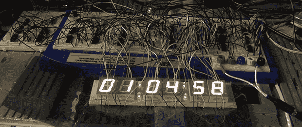

# 一个过于复杂的逻辑芯片时钟

> 原文：<https://hackaday.com/2013/10/29/an-overly-complicated-logic-chip-clock/>

当一个普通的闹钟不行的时候，唯一的选择就是完全用分立的逻辑芯片来打造你自己的[。[jvok]为去年的](http://jvok.spherical-sphinx.com/clock/) [7400 逻辑竞赛](http://hackaday.com/2012/09/06/2012-open-7400-logic-competition/)制造了这个闹钟。[jvok]决定使用 4000 系列逻辑芯片，这有点违背常理。这是规则允许的，其结果是一个不用微控制器也能做什么的极好例子。

我们见过的大多数时钟项目使用单个按钮来增加每个数字。[jvok]想做一些独特的事情，所以他可以用“模式”按钮设置他的时钟，允许他独立设置小时、分钟和秒钟。他只在基于微控制器的项目中见过这种设置时钟时间的方法，即使是简单的代码转换成纯电路也令人印象深刻。

这个时钟还包括一个报警功能，由一串二进制编码的十进制 DIP 开关设置。这是一项伟大的工作，值得比在开放逻辑竞赛中得到的更多关注。