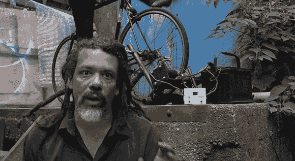

# 应急用自行车发电机

> 原文：<https://hackaday.com/2013/10/30/bicycle-generator-for-emergency-electricity/>

[Hackett's]又回来了，这一次为你的城市下一次停电提供了一些实用的建议:为什么不为最坏的情况做准备，建造自己的自行车发电机呢？毫无疑问，你会记得飓风桑迪摧毁了纽约市的电网，甚至淹没了变电站和引起大规模爆炸的。[Hackett]亲身经历了 Sandy 宕机，知道让这个简单的构建准备就绪的价值。

该项目使用永磁 DC 电机(约 250 瓦)，你可以在电动轮椅或其他移动踏板车中找到。在他的装置中，自行车车轮每转一圈，齿轮减速装置就会带动马达旋转 50 次。[Hackett]制造的将车轮压入电机主轴的装置特别聪明:一根螺纹杆调节电机的位置，电机用螺栓固定在一个铰接平台上，铰链的另一部分焊接在一个支撑自行车车轮的更大框架上。

电机连接到一个基于迈克·戴维斯设计的自制充电控制器，该控制器监控深度循环电池，在充满时停止充电，并在达到设定的放电水平后重新充电。剩下的就是小菜一碟了:有了连接到电源逆变器的深度循环电池，[Hackett]可以插上电源，保持手机充电，播放音乐，甚至(一些)灯亮着。如果你是[哈克特]直截了当、实用的演讲风格的粉丝，看看[的三脚架制作](http://hackaday.com/2013/09/22/hacketts-tripod-and-some-advice-on-abstraction/)和[剥离管道镀锌的演示](http://hackaday.com/2013/08/19/on-not-getting-metal-fume-fever-with-galvanized-conduit/)。

[https://www.youtube.com/embed/Q05NISGYYJg?version=3&rel=1&showsearch=0&showinfo=1&iv_load_policy=1&fs=1&hl=en-US&autohide=2&wmode=transparent](https://www.youtube.com/embed/Q05NISGYYJg?version=3&rel=1&showsearch=0&showinfo=1&iv_load_policy=1&fs=1&hl=en-US&autohide=2&wmode=transparent)

【谢谢贝基！]