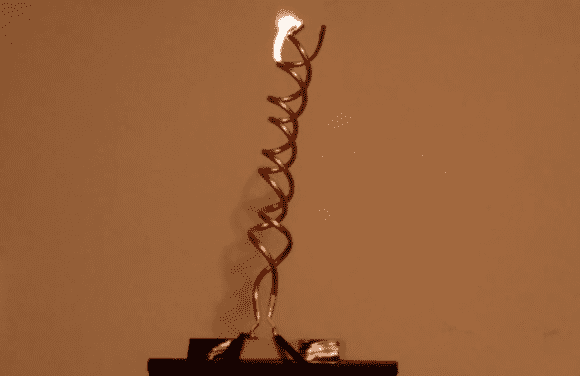

# 用这个双螺旋雅各布梯子点燃你的万圣节派对

> 原文：<https://hackaday.com/2013/10/31/spark-up-your-halloween-party-with-this-double-helix-jacobs-ladder/>

没有电火花，弗兰肯斯坦博士的实验室是不完整的。因此，对于[里克]今年的最后一次万圣节 DIY，他给了我们这个，但有所改变。这次是[双螺旋雅各布天梯](http://www.richardosgood.com/blog/2013/10/29/double-helix-jacobs-ladder/)。火花四溅，因为他们扭曲和转向这个独特的设计，由一个标准的霓虹灯变压器供电。如果你能弄到一个 15000 伏 30 毫安的变压器，你可能有足够的时间在万圣节做一个。

建筑很简单。除了变压器，你还需要几英尺长的柔性铜管和一根英寸长的 PVC 管。将铜管缠绕在聚氯乙烯管上形成双螺旋结构后，[Rick]将铜管安装在一块木头上，并移除聚氯乙烯模板。在他的视频中，你可以在休息后观看，[Rick]展示了一个标准的 Jacob's ladder，以及他的双螺旋设计。双螺旋版本有一个更好更慢的移动弧线，甚至有时会停下来。

你不要把它放在任何有人可能接触到的地方，因为它可能非常致命或导致烧伤。[Rick]提到不要使用木头来安装梯子，因为木头会像在他的测试中一样燃烧。不要在无人看管的情况下操作。否则，它会给你的万圣节增添一些乐趣。

[https://www.youtube.com/embed/-AsaGgb5ixo?version=3&rel=1&showsearch=0&showinfo=1&iv_load_policy=1&fs=1&hl=en-US&autohide=2&wmode=transparent](https://www.youtube.com/embed/-AsaGgb5ixo?version=3&rel=1&showsearch=0&showinfo=1&iv_load_policy=1&fs=1&hl=en-US&autohide=2&wmode=transparent)