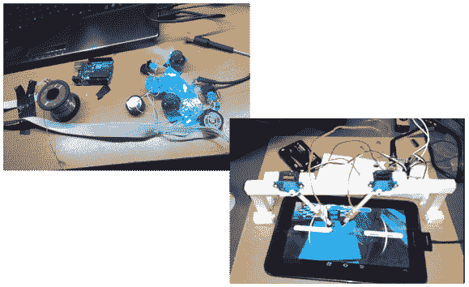
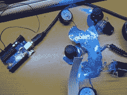
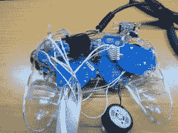
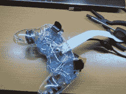

# 视频游戏自动化黑客

> 原文：<https://hackaday.com/2013/11/02/video-game-automation-hacks/>

第三方主机游戏控制器有时会炫耀一个“速射”按钮，给游戏玩家带来不公平的优势。[Connor 的]项目是沿着相同的路线，但他的黑客有一个不同的目标:自动输入 GTA5 欺骗代码。[Connor]承认这是他第一次破解 Arduino，但除了一个小问题，他成功地完成了。构建者通过一些带状电缆将 PS3 控制器上每个按钮连接到 Arduino Uno 上它自己的数字输出。在插入一些非常简单的代码后，[Connor]可以简单地按下一个按钮来自动化一个冗长的作弊代码过程。

在第二次视频游戏黑客攻击中，Matt 的黑客成功地为他节省了更多的用户输入，在 Android 游戏中自动点击手指。[Matt]将插入 PICAXE-18M2 微控制器的几个伺服系统拼凑在一起，在[Matt]的模拟人生免费游戏中重复一个简单的动作:不断“清新”(冲洗？)一个厕所。为了模仿两个手指的相同电容响应，[Matt]用一些防静电泡沫制作了两个接触面，然后用一根电线将它们接地到电路板上的地面。

休息之后，看看[康纳的]控制器画廊和[马特的]平板电脑黑客视频，然后看看攻击 XBox360 控制器的[快速射击控制器黑客](http://hackaday.com/2012/02/16/rapid-fire-update-brings-many-new-features/)。

[https://www.youtube.com/embed/g6HN9pghr3I?version=3&rel=1&showsearch=0&showinfo=1&iv_load_policy=1&fs=1&hl=en-US&autohide=2&wmode=transparent](https://www.youtube.com/embed/g6HN9pghr3I?version=3&rel=1&showsearch=0&showinfo=1&iv_load_policy=1&fs=1&hl=en-US&autohide=2&wmode=transparent)