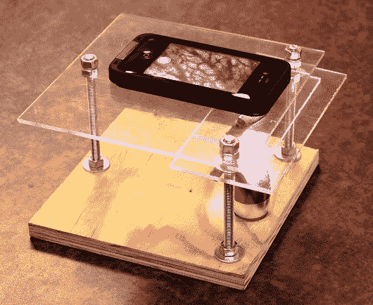

# 用你的智能手机当显微镜，花费不到 10 美元

> 原文：<https://hackaday.com/2013/10/30/use-your-smartphone-as-a-microscope-for-less-than-10/>

 【吉野家】最近发布了一份关于做一个 [$10 智能手机到显微镜转换](http://www.instructables.com/id/10-Smartphone-to-digital-microscope-conversion/)的说明书。这种黑客技术与其说是一种转换，不如说是一种方便的夹具，但它仍然很有趣。基本的想法是为幻灯片建立一个平台，并将智能手机直接安装在上面。诀窍在于，这可以被称为显微镜的原因是，[吉野家]将廉价激光笔的镜头嵌入智能手机支架。他能够通过镜头获得 40 倍的光学放大，即使牺牲了质量，他也使用内置的数字变焦获得高达 175 倍的放大。

就其本身而言，你可以用它和光源一起放大 3D 物体。[吉野家]用一角硬币证明了这一点。但由于载玻片架是由透明丙烯酸制成的，他在底座上安装了一个便宜的 LED 手电筒，作为样品的照明。利用这个装置，他能够观察到[质壁分离](http://en.wikipedia.org/wiki/Plasmolysis)的过程。

如果你有孩子，这当然是一个和他们一起做的项目，但我们不禁认为它对没有父母的人同样有用。这种放大倍数对于简单的实验室实验来说已经足够好了，考虑到大多数一天一次的读者都有这些部件，我们估计成本接近 0 美元。如果你尝试了，请在评论中告诉我们你的结果！

[https://www.youtube.com/embed/KpMTkr_aiYU?version=3&rel=1&showsearch=0&showinfo=1&iv_load_policy=1&fs=1&hl=en-US&autohide=2&wmode=transparent](https://www.youtube.com/embed/KpMTkr_aiYU?version=3&rel=1&showsearch=0&showinfo=1&iv_load_policy=1&fs=1&hl=en-US&autohide=2&wmode=transparent)