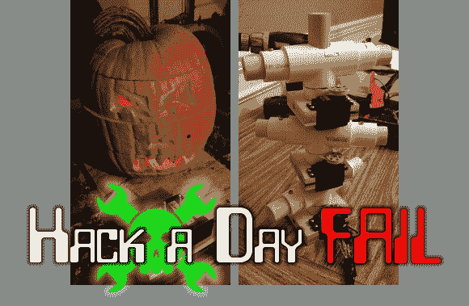

# 本周失败:27 面鬼火

> 原文：<https://hackaday.com/2013/10/31/fail-of-the-week-27-face-jack-o-lantern/>

纯粹的运气为这一周失败的帖子带来了万圣节主题的项目。[Stryker]在提示栏中写了一个链接，分享了一个非常棒的黑客技术。他在南瓜的侧面雕刻了四张不同的脸，然后将眼睛、鼻子和嘴巴切成不同的部分。再加上由木头和聚氯乙烯制成的内部骨架，他就有了一个不错的黑客工具，让“不给糖就捣蛋”的人[旋转这些部分，从多达 27 个不同的面孔中选择一个](http://www.instructables.com/id/27-faced-rotating-pumpkin)。

这些部分旋转得相当好，完成的项目看起来棒极了。那么失败的是什么呢？休息之后我们会报道的。

看看右边的支撑结构。你是否已经注意到每个部分都有一个附加的业余爱好伺服电机？这些是为了使鬼火机械化。每个都使用一条皮带与 PVC 配件连接，Arduino 用于控制电机。[Stryker]在他的视频描述中展示了这一点。他说他的“伺服滑轮坏了”。我们假设这意味着要么是塑料轮本身，要么是皮带，希望不是电机。他计划明年再试一次。

我们能帮助头脑风暴一个简单的改进吗？提到了齿轮和链传动。这是挽救这个概念的最简单的方法吗？他应该从哪里获得齿轮和链条？在评论区留下你有用的想法。

* * *

** 每周失败是一个每周三运行的黑客专栏。通过写下你过去的失败和[给我们发送一个故事的链接](mailto:tips@hackaday.com?Subject=[Fail of the Week])，或者发送你在互联网旅行中发现的失败报道的链接，来帮助保持乐趣。**