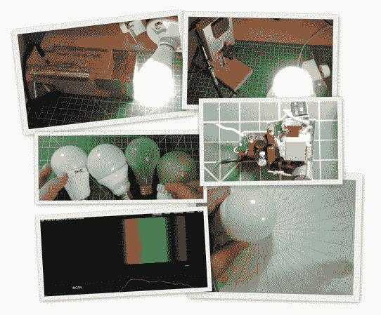

# LED 灯泡审查、评估和拆卸

> 原文：<https://hackaday.com/2013/11/01/led-bulb-reviews-evaluations-and-teardowns/>

[ElectronUpdate]发布了许多关于商用 LED 灯泡的精彩评论，人们可以购买这些灯泡来取代标准的 E26 白炽灯泡。在他的评论中，他评估了发光性能，并做了彻底和详细的拆卸，评估和理解所使用的电路技术。对于光发射评估，他使用一个测光表和一些自制的绘图纸来绘制不同角度的流明。闪烁很容易评估使用太阳能电池板从一个废弃的太阳能路径灯连接到他的示波器。任何闪烁都会很好地显示出来，并且可以测量。当然，在大多数评论中，杀死一瓦特计是用来读取瓦特和功率因数的。

最近[ElectronUpdate]想了解许多商业 LED 封装上广告的 CRI 的含义。CRI 代表[显色指数](http://en.wikipedia.org/wiki/Color_rendering_index)，处理与自然光源相比颜色如何出现。在做了一些研究后，他发现 CRI 超过 80 可能有利于 LED 照明。下一个难题是如何在没有昂贵的科学设备的情况下测量 CRI。他找到了一个我们在之前介绍过的[网站，上面有免费软件和如何建造](http://hackaday.com/2012/08/27/turning-a-webcam-into-a-spectrometer/)[光谱仪](http://en.wikipedia.org/wiki/Spectrometer)的说明。网页上的说明包括用纸做一个仪表盒，但他发现如果用木头做会更可靠。如果你愿意，我们会让你按照[ElectronUpdate 的] [推荐的建造](http://electronupdate.blogspot.com/2013/10/spectrometer-for-led-bulb-testing.html)，但是你需要一些他详细说明的物品。

经过[短暂的校准程序](http://publiclab.org/wiki/spectral-workbench-usage)后，最终的设备将测量你的光源的功率谱密度。[电子更新]承诺提供更多关于彩色测量数据如何与 CRI 评级相关的细节，但你可以在[全光谱解决方案](http://www.fullspectrumsolutions.com/cri_explained.htm)获得更多细节。如果 LED 灯泡的进步性能和内部结构让你和我们一样感兴趣，我们也建议你浏览 YouTube 上所有的【电子更新】 [LED 灯泡评论](http://www.youtube.com/user/electronupdate/videos)。