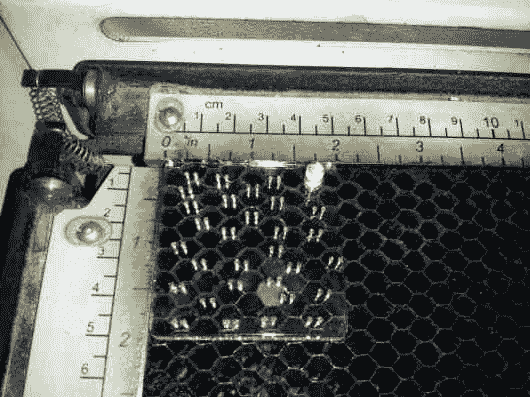
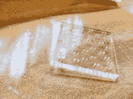
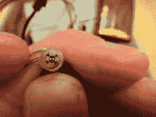
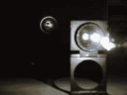
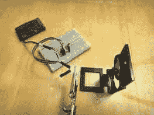
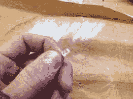

# 来自单个 LED 的 Hackaday 徽标投影仪

> 原文：<https://hackaday.com/2013/10/31/hackaday-logo-projector-from-a-single-led/>

这是另一个小饰品大赛的参赛作品，它本身就很有趣。[亚当]做了他自己的蝙蝠信号的黑客版本。它没有那么大，但概念是一样的。使用这种经过改进的 LED，他能够投射出一幅看起来非常清晰的 12 英寸图像(更多图片见下文)。

这个 LED 是他从一个旧手电筒上取下的。打磨平圆顶后，他制作了一个夹具，将它放在激光切割机内。在那里，他蚀刻了 0.1 英寸的标志，并用一些墨水填充了负空间。剩余的表面被抛光以帮助光线穿过，然后放置在珠宝商的放大镜前以放大图像。

还有几个小时，小饰品大赛就要结束了。获取您的参赛资格，有机会赢取大奖！

           