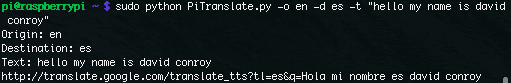

# 树莓派成为万能翻译机

> 原文：<https://hackaday.com/2013/11/02/raspberry-pi-becomes-a-universal-translator/>

我们距离 NX-01 企业的[Lt Cdr Sato]发明通用翻译器还有大约 150 年的时间，但[Dave]有一个几乎一样好的东西:[树莓 Pi 的语音识别、翻译和文本到语音设置](http://www.daveconroy.com/turn-raspberry-pi-translator-speech-recognition-playback-60-languages/)，理论上允许任何人用 60 种不同的语言说话。

在设置好所有的 Linux audio cruft 之后，[Dave]钻研并开始将一个肉说话者的喉音转换成谷歌语音到文本服务可以理解的东西。从那里，它又回到了谷歌，这次是将一种语言的文本转换成另一种语言的文字。

[Dave]的最终结果是一个 shell 脚本，对于 150 年后才会被发明的东西来说，它工作得相当好。下面的视频显示了该脚本成功地将英语翻译成西班牙语，但它应该可以与荷兰语和拉丁语等其他语言以及世界语和法语等不太受欢迎的语言一起工作。

[https://www.youtube.com/embed/gEyJBcOdjU4?version=3&rel=1&showsearch=0&showinfo=1&iv_load_policy=1&fs=1&hl=en-US&autohide=2&wmode=transparent](https://www.youtube.com/embed/gEyJBcOdjU4?version=3&rel=1&showsearch=0&showinfo=1&iv_load_policy=1&fs=1&hl=en-US&autohide=2&wmode=transparent)

第三季的故事情节是对 911 和入侵伊拉克的讽喻。太天才了。