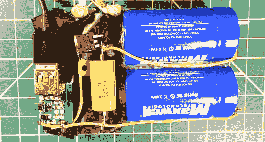

# 基于超级电容的手机充电器

> 原文：<https://hackaday.com/2013/11/02/supercap-based-cell-phone-charger/>

 【巴里】给我们发了一个来自【电子更新】[的视频提示，描述了一个实验手机充电器](http://www.youtube.com/watch?v=KL1N_ThFkBc)。这是一个熟悉的问题:你的手机电池电量低，你没有能力插上电源充电几个小时。一些手机，包括他视频中的手机，有可更换电池，但这也不总是一个选项。正如他在视频中解释的那样，墙壁插座可以在几秒钟内提供高端电池的焦耳容量，但不可能这么快给电池充电。另一方面，电容器几乎可以瞬间充电。

[electronupdate]决定研究使用超级电容器为典型的 usb 插头供电的可能性。它可以让你在短时间内为辅助电源充电，然后上路，让你的手机从设备中慢慢充电。

他的实验并不完全成功，可能是因为他使用了 2.7V 的电容器，这需要一个升压调节器，并限制了有用的电压范围。我们认为他使用 120V 电容器和开关电源可能会取得更好的成功，但如果能看到各种选项的对比，那就更好了。

哦，[电子更新]描述了当你冲向你的飞机时使用这个电路。我们不认为携带几个超级电容器通过 TSA 检查站是最好的主意… YMMV。

[https://www.youtube.com/embed/KL1N_ThFkBc?version=3&rel=1&showsearch=0&showinfo=1&iv_load_policy=1&fs=1&hl=en-US&autohide=2&wmode=transparent](https://www.youtube.com/embed/KL1N_ThFkBc?version=3&rel=1&showsearch=0&showinfo=1&iv_load_policy=1&fs=1&hl=en-US&autohide=2&wmode=transparent)