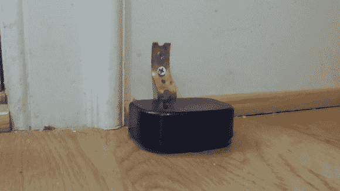

# DIY 狗狗门铃

> 原文：<https://hackaday.com/2013/11/03/diy-doggy-doorbell/>

你的狗是坚强沉默型的吗？曾经希望他或她能告诉你什么时候该去做他们的生意吗？这位 Reddit r/DIY 用户找到了一个简单的解决方案——[一个狗狗门铃！](http://imgur.com/a/h3bxG)

有问题的狗不太爱说话，所以它的主人寻求一个简单的解决方案，类似于巴甫洛夫的铃铛——唯一的问题？他需要一些音域，因为你不可能总是在整个房子里听到几声钟声。解决办法？他把一个无线门铃重新包装成一个对狗友好的按钮！

与我们上一篇关于[自动宠物饮水系统的文章相比，](http://hackaday.com/2013/10/21/pet-water-warden/)这是一个非常简单的黑客，完全不需要电气经验。不过，通过并联第二个开关，狗也可以在屋外按门铃，这种方法很容易改进。

据主人说，只需几次款待，这只狗就能训练得足够好，在需要外出时随时使用它！

[Via [Reddit](http://www.reddit.com/r/DIY/comments/1pnrss/wireless_doggy_doorbell_so_you_can_know_when_fido/)