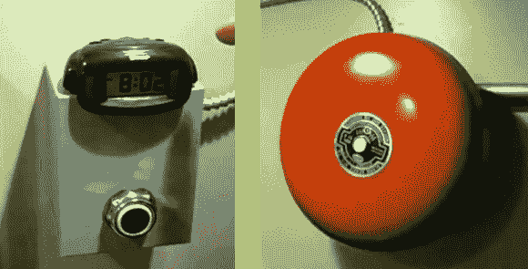

# 火钟通过减少你的寿命来唤醒你工作

> 原文：<https://hackaday.com/2013/11/03/fire-bell-wakes-you-for-work-by-shaving-years-off-your-life/>

如果你早上起床很糟糕，杰克·李有一个解决办法，可以确保你不会被解雇。不幸的是，这会吓得你魂飞魄散——但也许我们只是没有足够的睡眠能力去体会闹钟的价值，它的声音大得可怕。

起初我们想知道他从哪里得到这个铃铛，但是看起来你可以花大约 15 美元买到一个。我们并不是说你应该在你最好的朋友的床下藏一个这样的东西，但是这个铃铛的价格确实把它放在了一个值得恶作剧的价格范围内。[杰克]使用刚性和柔性导管将钟连接到电源，控制面板显示在左边。他使用床头闹钟的 LED 背光来驱动晶体管的基极，切换继电器来触发铃声。灰色盒子上的大按钮使哀号停止(说真的，在下面的剪辑中，在你到达 0:30 之前，请降低音量)。

[https://www.youtube.com/embed/P91WX58Lmy0?version=3&rel=1&showsearch=0&showinfo=1&iv_load_policy=1&fs=1&hl=en-US&autohide=2&wmode=transparent](https://www.youtube.com/embed/P91WX58Lmy0?version=3&rel=1&showsearch=0&showinfo=1&iv_load_policy=1&fs=1&hl=en-US&autohide=2&wmode=transparent)