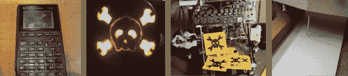
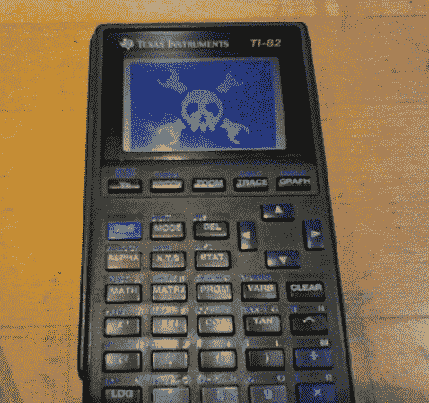
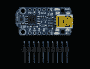
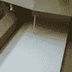

# 饰品比赛更新#7

> 原文：<https://hackaday.com/2013/11/04/trinket-contest-update-7/>

这是饰品大赛的最后更新。我们希望在周末宣布获胜者(有很多东西需要挖掘！).如果你没有看到你的更新，要么我们没有收到，它不是一个完整的条目，或者你错过了截止日期。

休息之后你会看到最后八名选手。

 【亚伦的】今年用他的鬼火表现出一些爱意。

 这个徽章是【卡洛斯】在[他的黄铜蚀刻指南](http://www.instructables.com/id/Etch-a-badge/)中使用的一个例子。

[Christopher Mitchel]在他的图形计算器上发送了一个位图，这并不奇怪，因为我们之前已经看过[他在这个硬件](http://hackaday.com/2010/12/16/peer-network-using-graphing-calculators/)上的工作几次了。从[他最近的帖子](http://www.cemetech.net/projects/item.php?id=49)中了解对计算器进行的黑客攻击。

Yo Dawg……[Andrew]将我们的标志放在小饰品上，赢取小饰品。他承认使用了 Gimp，而不是实际上蚀刻了 uC 的案例。

 这张来自一个未具名的提交者。他说他不像其他人一样有好的工具，但是他想做一些酷的事情。他用 200 毫瓦的激光在电脑鼠标上手工蚀刻了这个标志。我们认为这非常棒！

这个实际上是个黑客。[迈克尔]一直想把他的 RepRapPro Huxley 变成一个笔式绘图仪。他没有时间好好做，所以他只是用拉链把一支笔绑在挤压机上，然后[印了一片商标](http://www.youtube.com/watch?v=k-9QPjXV32g)。

 这是这个未知提交者工作的动机镜。

 【塞巴斯蒂安】在他的数控镂铣机里装了压花笔，用来制作他的婚礼请柬，所以他特地跑来参加比赛。