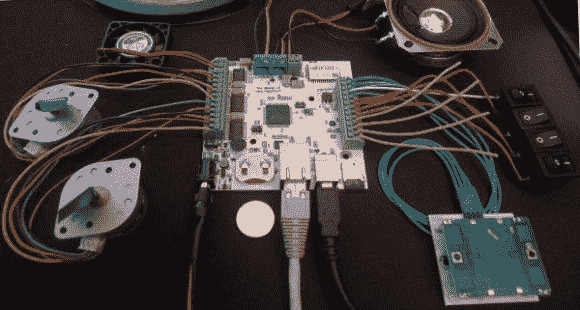

# 基于 Cortex M4 的平台，带有以太网、USB、BT 和许多板载外设

> 原文：<https://hackaday.com/2013/11/06/a-cortex-m4-based-platform-with-eth-usb-bt-and-many-on-board-peripherals/>

这是我去年夏天参与的一个非常耗时的项目:一个基于 ARM Cortex M4 的平台,带有大量通信接口和板载外设。开发该板的特定项目实际上没有材料(我父亲的有趣想法之一)，所以我将只描述平台本身。该项目中使用的微控制器是 Atmel 的 ATSAM4E16C，它有 1 MB 的 flash 和 128 kb 的 SRAM。它集成了一个以太网 MAC、一个 USB 2.0 *全速*控制器、一个复杂的模数转换器和一个数模转换器(等等)。

这里列出了板上的不同元件，以便您更好地了解该平台的功能:一个麦克风及其放大器、一个电容式触摸传感器、两个单极步进电机控制器、两个 mosfets、一个 microSD 卡连接器、一个蓝牙转串行桥、一个线性电机控制器以及一个备用电源电池座。你可以看看我做的一个简单的演示视频，休息后嵌入。固件是用 C 语言编写的，使用 Atmel 软件框架。该项目显然是开放硬件(Kicad)和开放软件。

[https://www.youtube.com/embed/ICP42gZZK6U?version=3&rel=1&showsearch=0&showinfo=1&iv_load_policy=1&fs=1&hl=en-US&autohide=2&wmode=transparent](https://www.youtube.com/embed/ICP42gZZK6U?version=3&rel=1&showsearch=0&showinfo=1&iv_load_policy=1&fs=1&hl=en-US&autohide=2&wmode=transparent)

如果你对一个平台感兴趣，并且不想花很多时间焊接它，我甚至制作了一个[无利润筹款](https://www.tindie.com/products/limpkin/the-beast-a-very-versatile-platform/)(尽管我需要一个更好的相机和更好的口音！).