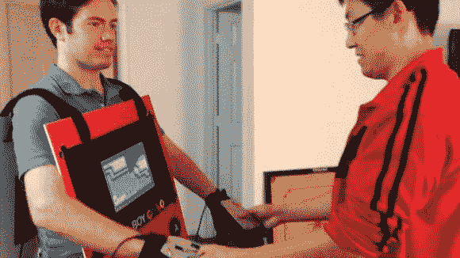

# GameBoy 彩色服装

> 原文：<https://hackaday.com/2013/11/07/gameboy-color-costume/>

好吧好吧。我们知道现在是 11 月，但是当[John]提交这个项目时，我们不得不分享它。他做了一套功能齐全的 [Gameboy 彩色服装！](http://www.youtube.com/watch?v=P55AuMkCZGg)

这套服装使用了一个树莓派(位于他的背部)，运行 [RetroPie](http://blog.petrockblock.com/retropie/) ，这是一个开源项目，致力于创建一个通用的控制台模拟器。为了创建控制器，他在手套中使用了两个微型控制器，设置为模拟 Pi 上的两个 USB 键盘。由于他使用的是 Teensy 3.0，它支持电容触摸感应，所以他所要做的就是将铝片连接到输入引脚，以在手套上创建触摸感应金属按钮。然后，他把 Adafruit 的廉价 10 英寸液晶显示器放在胸前，在口袋里塞了几块 12V 的 LiPo 电池，准备好参加任何派对。

这套服装获得了巨大的成功，尽管一对讨厌的马里奥和路易吉整晚都拉着他的手…休息后留下来看演示视频！

[https://www.youtube.com/embed/P55AuMkCZGg?version=3&rel=1&showsearch=0&showinfo=1&iv_load_policy=1&fs=1&hl=en-US&autohide=2&wmode=transparent](https://www.youtube.com/embed/P55AuMkCZGg?version=3&rel=1&showsearch=0&showinfo=1&iv_load_policy=1&fs=1&hl=en-US&autohide=2&wmode=transparent)