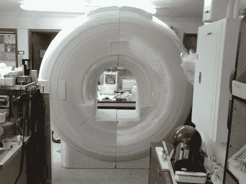

# 全尺寸磁共振成像机器复制品

> 原文：<https://hackaday.com/2013/11/09/full-size-mri-machine-replica/>

最近在西雅图的 Metrix Create:Space 有点灰尘。这是因为他们承担了迄今为止最大的项目——一台用于大学研究的核磁共振仪的全尺寸复制品。

[汤姆·格拉博斯基]是华盛顿大学的放射学和神经病学教授，他需要一台复制的 MRI 机器。这是因为在真正的磁共振成像机器上花费的时间非常昂贵，而且在进行自闭症研究时，在使用真正的交易之前让测试对象习惯这个过程是很重要的。他最初求助于华盛顿大学的人类发展和残疾中心，但是这个项目对他们的机构来说太大了。然而，他确实遇到了一位名叫[Fritz]的研究员同事，他随后联系了 Metrix，看是否有可能，并且像任何优秀的黑客一样，该领域的成员已经准备好迎接挑战。

复制的 MRI 机器由 2 英寸厚、4 英寸乘 8 英寸的泡沫绝缘片制成，这是他们的路由器能够处理的最大尺寸。之前没有使用过 3D z 切割功能，他们需要学习一些东西，但正如你从图片中看到的，效果很好。经过几周的时间，他们能够构建出 MRI 机器的大致形状，并很好地完成了表面——但这还远远没有完成，因为他们甚至可能添加了灯光和其他功能，使其成为一个复制品。这是一个伟大的项目，那些提供帮助的人很乐意这样做，因为这个复制品不仅会让[汤姆]受益，还会让 UW 的许多其他研究人员受益——对科学来说，是的！