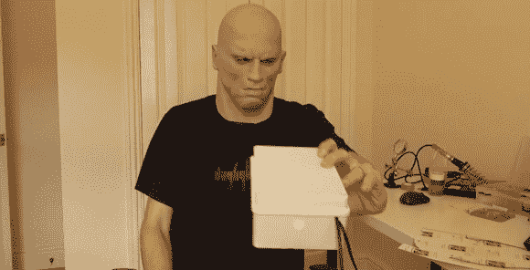

# 用树莓派检测伪装

> 原文：<https://hackaday.com/2013/11/09/detect-disguises-with-a-raspberry-pi/>

基于计算机视觉的人脸检测系统每天都在进步。当局已经使用人脸检测和犯罪数据库好几年了。但是如果被检测的人戴着口罩呢？高质量的面具已经走出好莱坞，成为主流。期望有人使用这样的面具来避免被发现并不太牵强。为了解决这个问题，[【尼尔】发明了一个检测面具的系统](http://www.aicbt.com/disguise-detection/)。

这个想法其实很简单。人脸有一个清晰的热信号。一个掩码不会有相同的签名。即使戴上几个小时，面具仍然无法模仿人脸的红外特征。这类工作的最佳工具是高分辨率热成像相机。这些相机仍然相对昂贵，所以[Neil]使用了一个[Melexis mlx 90620](http://www.melexis.com/Infrared-Thermometer-Sensors/Infrared-Thermometer-Sensors/MLX90620-776.aspx)64×816×4 阵列传感器。Melexis 传感器与 Arduino nano 接口，Arduino nano 通过串行接口连接到 Raspberry Pi。

Raspberry Pi 使用 Pi 相机来获取图像。OpenCV 的人脸检测随后被用于搜索人脸。如果检测到人脸，来自 Melexis 传感器的数据就会发挥作用。在[尼尔的]概念验证系统中，环境温度的变化是检测人脸真伪所需要的。正如在休息后的视频中可以看到的那样，该系统工作得相当好。考虑到目前政府监控的氛围，我们既兴奋又有点担心这项技术在现实世界中的应用。

[https://www.youtube.com/embed/UGyM817b1gc?version=3&rel=1&showsearch=0&showinfo=1&iv_load_policy=1&fs=1&hl=en-US&autohide=2&wmode=transparent](https://www.youtube.com/embed/UGyM817b1gc?version=3&rel=1&showsearch=0&showinfo=1&iv_load_policy=1&fs=1&hl=en-US&autohide=2&wmode=transparent)