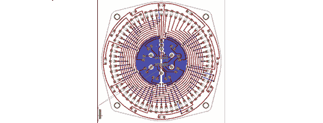

# 用老鹰做任何形状的板子

> 原文：<https://hackaday.com/2013/11/10/make-any-shape-board-in-eagle/>

[Bryan]一直在研究一个非常好的模拟 LED 时钟电路，但当需要在 Eagle 中布局零件时，他对无法在 Eagle 电路板上进行设计感到有些恼火。Eagle 是设计电路的好工具，但要制作形状奇怪的 PCB，Eagle 就不是合适的工具。

这个问题的解决方案是[在 OpenSCAD](http://bryanduxbury.com/2013/11/09/using-an-openscad-shape-as-the-board-outline-in-eagle/) 中创建电路板轮廓。[Bryan]想要的时钟形状很容易设计，但是将形状导入鹰层完全是另一回事。

不过，OpenSCAD 可以将 2D 图形输出为 DXF 格式。让 DXF 板进入 Eagle 需要[Bryan]写一个输出 Eagle WIRE 命令的脚本。将这些命令粘贴到命令行中给了[Bryan]一个形状完美的 PCB。

由于 DXF 被这个星球上的每一个绘图包所支持，[布莱恩]的 20 行脚本也可以用于更复杂的设计。如果你有一个非常复杂的 Illustrator 绘图，它应该是一个 PCB，它不会比通过一个脚本更容易。