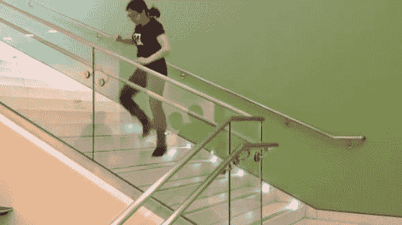

# 黑客普林斯顿:钢琴楼梯！

> 原文：<https://hackaday.com/2013/11/11/hackprinceton-piano-stairs/>

是黑客。普林斯顿大学这个周末和[邦妮]和[埃里卡]一起做了这个[伟大的互动便携式钢琴！](http://bonnie-eisenman.tumblr.com/post/66630942173/hackprinceton-fall-2013-piano-stairs)

设置非常简单，使用六个 LED 手电筒和六个光敏电阻。Arduino Uno 读取光敏电阻的值，并将其解析到附近的 Raspberry Pi，然后由它发出声音。该系统甚至在打开时自动校准自己，根据环境光线条件进行调整。他们为[黑客马拉松](http://hackprinceton.com/)做了这个项目，在短暂的害怕不得不将它移到另一个楼梯进行演示后，他们在硬件类别中获得了第二名！

休息后留下来看看它的运行——这将是一个让孩子们对黑客感兴趣的很好的学校项目！

[https://www.youtube.com/embed/2mHj853z_PU?version=3&rel=1&showsearch=0&showinfo=1&iv_load_policy=1&fs=1&hl=en-US&autohide=2&wmode=transparent](https://www.youtube.com/embed/2mHj853z_PU?version=3&rel=1&showsearch=0&showinfo=1&iv_load_policy=1&fs=1&hl=en-US&autohide=2&wmode=transparent)

寻找更多的钢琴黑客？香蕉钢琴怎么样？没有？一副[没有实体钢琴的手套怎么样？](http://hackaday.com/2011/11/07/wireless-midi-piano-glove/)或者用铅笔写在纸上的[？](http://hackaday.com/2013/09/29/musical-pencil-synthesizer/)