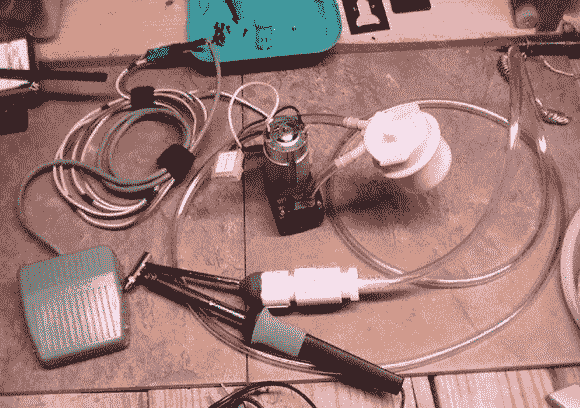

# 廉价建造你自己的拆焊站

> 原文：<https://hackaday.com/2013/11/11/build-your-own-desoldering-station-on-the-cheap/>

[黑貂狼]以不到 70 美元的价格向我们透露了他在 DYI 的拆焊站。我们知道我们以前见过这种转换，但它没有在 Hack a Day 上出现过。[黑貂狼]的黑客是独特的，并增加了一些功能，使建筑，清洁和整体寿命更健全。然而，必须在水泵周围建造某种隔音外壳，因为它在视频中显得很吵，令人不舒服。

一些中国制造的拆焊站越来越便宜，所以也许不值得努力，除非你能为建造打捞更多的组件。多亏了[黑貂狼]的详细博客，你可以浏览他的 BOM，并从你的回收箱中找到这些物品中的大部分。一个便宜但可靠的脱焊站将是你工作台上非常方便的工具。

这比过去用蜡烛或[用火](http://hackaday.com/2013/09/19/desoldering-chips-with-fire/)拆焊要安全得多，而且有点像在 [SMD 热风铅笔](http://hackaday.com/2009/10/23/hot-air-pencil-for-under-20/)黑客上的翻转。

休息之后，请继续观看拆焊站的视频。

[https://www.youtube.com/embed/VBI2s2clTQA?version=3&rel=1&showsearch=0&showinfo=1&iv_load_policy=1&fs=1&hl=en-US&autohide=2&wmode=transparent](https://www.youtube.com/embed/VBI2s2clTQA?version=3&rel=1&showsearch=0&showinfo=1&iv_load_policy=1&fs=1&hl=en-US&autohide=2&wmode=transparent)