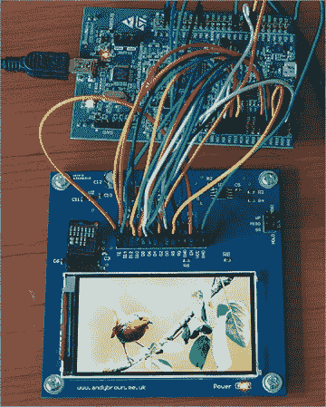

# 反向工程的索尼爱立信 Vivaz 高分辨率 640 X 360 手机液晶显示器

> 原文：<https://hackaday.com/2013/11/12/reverse-engineering-the-sony-ericsson-vivaz-high-resolution-640-x-360-cellphone-lcd/>

在我们看来，逆向工程可能是戏弄你大脑的最好方法之一。[安迪]刚刚通过对索尼爱立信 Vivaz 高分辨率液晶显示器(缓存副本[在这里](http://andybrown.me.uk.nyud.net/wk/2013/10/19/vivaz-u5-lcd/))进行逆向工程做到了这一点。在他写得(非常)好的文章中，[Andy]解释了导致他达到上图所示结果的所有步骤。他首先找到 Vivaz 的维修手册，发现显示器可以与 8080 型并行信号接口。这意味着他可以使用没有高速总线的标准微控制器与之接口，本例中为 STM32F4。在接下来的冒险中，[Andy]订购了合适的连接器，并对板载微控制器进行了更有根据的猜测。谷歌搜索了很久，找到了瑞萨的 R61523。所以他设计了他的分线板，把它生产出来，几个小时后，一张漂亮的图片就出现在 LCD 上了。他甚至花时间将原始显示与他在网上找到的克隆进行比较，并修改了他的[图形库](http://andybrown.me.uk/wk/downloads/)来支持这种显示。