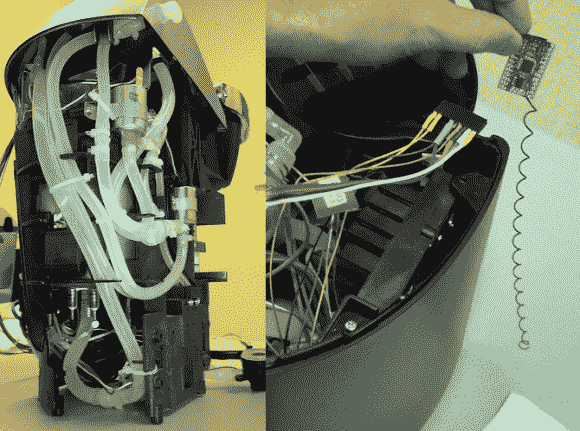

# 无线 Keurig 黑客！

> 原文：<https://hackaday.com/2013/11/12/wireless-keurig-hack/>

[Kolumkilli]喜欢他的 Keurig 咖啡机，因为它能让他煮出一杯上好的咖啡，但他不喜欢等着它煮好。所以他开始通过电脑无线控制它…只要按一下按钮，他就可以准备好咖啡，等着他起床。

在小心翼翼地拆开他的 Keurig 之后，他开始在印刷电路板上定位主要按钮，并着手将继电器与他想要控制的继电器并联起来。放入一个 [Moteino](http://lowpowerlab.com/moteino/) 并添加通知 led 作为输入，现在他可以通过办公桌上的网络浏览器控制和监控几乎所有咖啡机的功能。现在，要是他能记得放一个新的咖啡杯进去就好了…

论坛帖子上有一篇很棒的文章，所以如果你想看更详细的构建日志，去看看吧！如果你想给你的 Keurig 增加更多的功能，为什么不给它装一条水管呢？

[谢谢菲利克斯！]