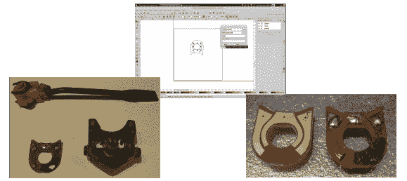

# 用扫描仪和 Inkscape 重新创建 PCB

> 原文：<https://hackaday.com/2013/11/15/recreate-a-pcb-with-a-scanner-and-inkscape/>

[John]已经设法通过扫描并转换成 Gerber 格式来替换损坏的转向信号 PCB。[约翰]买了一辆[凯旋喷火](http://en.wikipedia.org/wiki/Triumph_Motor_Company)，上面装有拨动开关，用于控制转向灯。“官方”更换的部分比拨动开关好用，但转了一圈也没取消。他找到了原来的开关，却发现酚醛板上有一个完全烧穿的洞。这并不完全令人惊讶，因为黛安芬使用了[卢卡斯工业](http://en.wikipedia.org/wiki/Lucas_Industries)电气系统。任何拥有卢卡斯“黑暗王子”电气系统汽车的人都会告诉你，卢卡斯系统并不以质量著称。快速的谷歌搜索会显示出大量的页面来证明这一点。

酚醛树脂/纸是早期常见的 PCB 材料。今天最常用的 FR-4 玻璃纤维板可以被认为是 FR-1 和 FR-2 酚醛树脂的后代。(本例中的 FR 代表纤维增强)。标准化对[John]有利，因为他烧过的电路板有 31 密耳厚，这仍然是标准的 PCB 厚度。重新创建一个像这样的奇数大小的董事会并不是一件难事。然而，这意味着要花相当多的时间用尺子和卡尺。与其花那么多时间测量和重新绘图，[John]不如在平板扫描仪上扫描他的 PCB。他使用绘图纸作为背景，以验证图像没有被拉伸或扭曲。

[约翰]把他的扫描带进 [inkscape](http://inkscape.org/) 中，并描绘出轮廓和铜区域。轮廓和铜必须作为两个单独的文件导出，因此他在电路板轮廓外添加了角标记作为基准。然后他使用 [pstoedit](http://www.pstoedit.net/) 将 inkscape 的 eps 输出文件转换成 [gEDA pcb](http://www.gpleda.org/) 格式。这两个文件在 gEDA 中重新合并。从那里[John]出口了一个 Gerber，并在他的家用 PCB 铣床上运行。结果看起来不错。[John]计划在专业 PCB 工厂对电路板进行另一次修改，使用过孔将铜固定在基板上。