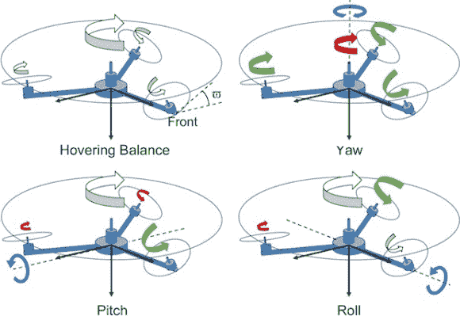

# 是不是所有四旋翼都应该是这个样子？

> 原文：<https://hackaday.com/2013/11/16/should-all-quadrotors-look-like-this/>

近年来，四旋翼飞行器越来越受欢迎。它们已经变得便宜、耐用，并且可以做一些真正令人印象深刻的事情，但是它们是最有效的设计吗？[昆士兰大学不这么认为](http://spectrum.ieee.org/automaton/robotics/aerial-robots/iros-2013-should-quadrotors-all-look-like-this)。

直升机仍然更加高效和强大，因为它们有一个大转子，并且有旋转斜盘机制，也许更具机动性——毕竟你看到我们最近关于[集体俯仰推力矢量](http://wp.me/pk3lN-s0f)的帖子了吗？那是一架飞机！快速搜索几个[直升机技巧](http://www.youtube.com/watch?v=p8t41avFuCc)，我们认为你会同意。

新的设计暂定名为 Y4，或者可能是“Triquad ”,仍然是四旋翼飞行器，但它有点混乱，兼顾了两个世界的优点。它有一个带旋转斜盘机制的主螺旋桨，三个以 45 度角固定的较小转子，提供反扭矩——有点像有三个尾翼的直升机。

关于效率，研究人员预计，与标准四旋翼飞行器相比，这种设计可以实现约 25%的整体性能提升。因此，他们决定进行测试，并建造了一个尽可能相似的 quad 和一个 Y4——相同的大小、质量、电池、臂和控制板。结果呢？Y4 的运行时间增加了 15%！他们认为这种设计很可能达到 25%的目标，因为在这项测试研究中，Y4 的设计符合 quad 的规格，而没有这些限制的更精致的 Y4 可能会表现得更好。

不幸的是，我们找不到视频，但如果你在休息后留下来，我们有一个很好的图表来说明这种设计是如何(以及为什么)工作的！

[通过 [IEEE 自动化](http://spectrum.ieee.org/automaton/robotics/aerial-robots/iros-2013-should-quadrotors-all-look-like-this)