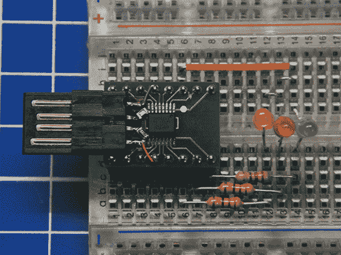

# FT230X 为串行 IC 游戏带来 USB 充电检测

> 原文：<https://hackaday.com/2013/11/16/ft230x-brings-usb-charging-detection-to-the-serial-ic-game/>

这里有一个来自 FTDI 的新芯片，它为 USB 到串行转换器系列带来了一个很好的小功能:充电检测。这意味着它能够检测何时连接了电池充电器。这到底意味着什么？数据表的顶部给出了简短的版本，但让我们来看看[宝石]进行的调查，以测试这一特定功能的完整程度。我们同意他的观点，所列出的能力给那些知情人留下了许多疑问:

> USB 电池充电器检测。允许 USB 外围设备检测更高电源的存在，以改善充电。

显然，芯片将能够告诉充电器何时连接，提醒设备何时开始补充额外的毫安。但是什么类型的充电器会真正触发检测电路呢？在装配好上面显示的测试电路后，他经历了几个场景:通过外部供电和非供电 USB 集线器直接连接到 PC USB 端口，以及使用多个壁式充电器。测试的全部结果包含在上面链接的帖子中。

[via [危险原型](http://dangerousprototypes.com/2013/11/12/ft230x-charger-detection-investigation/)