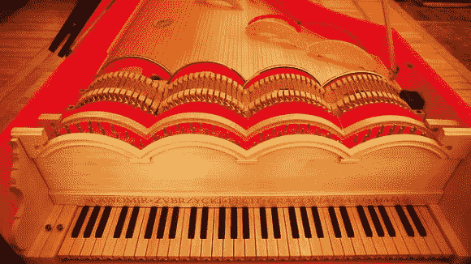

# 达芬奇的中提琴风琴

> 原文：<https://hackaday.com/2013/11/19/da-vincis-viola-organista/>

达芬奇有许多未完成的项目，就像这里的许多黑客一样。幸运的是，他比我们更擅长写下自己的想法。这是他的[中提琴风琴](http://www.theage.com.au/entertainment/music/leonardo-da-vincis-wacky-piano-is-heard-for-the-first-time-after-500-years-20131118-2xpqs.html)，由【Slawomir Zubrzycki】重新创作——一件机械艺术作品，听起来也不错！

如果你熟悉一把[绞弦琴](http://www.youtube.com/watch?v=r4y7HNW972M)，这基本上是同样的事情——但是规模要大得多。它是风琴、竖琴和中提琴的结合。代替锤子敲击 61 根钢弦，旋转的马毛轮(类似于弓)通过键盘和踏板动力曲轴的输入轻抚每根弦。其结果是一种非常独特的声音，令人想起它所结合的每一种乐器。

该仪器的设计在达芬奇的《大西洋法典》中被发现，这是一部 12 卷的收藏，收集了他的许多手稿和设计，记录了从他的飞行器到武器的一切。[Slawomir]花了三年时间和 5000 多个小时来完善他的版本。

休息后留下来听听它的运行！不要忘记打开字幕，除非你的波兰语很流利！

[https://www.youtube.com/embed/gOrn_z9m9lU?version=3&rel=1&showsearch=0&showinfo=1&iv_load_policy=1&fs=1&hl=en-US&autohide=2&wmode=transparent](https://www.youtube.com/embed/gOrn_z9m9lU?version=3&rel=1&showsearch=0&showinfo=1&iv_load_policy=1&fs=1&hl=en-US&autohide=2&wmode=transparent)

【via[Reddit](http://www.reddit.com/r/Music/comments/1qx30j/leonardo_da_vincis_dreaminstrument_has_been_built/)