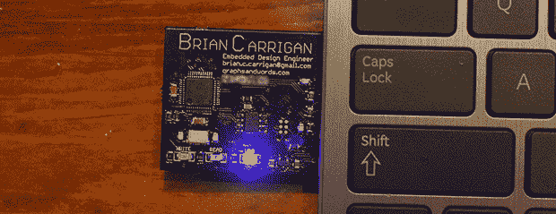

# ARM 驱动的名片，第二部分

> 原文：<https://hackaday.com/2013/11/24/an-arm-powered-business-card-part-two/>

虽然大多数微控制器驱动的名片选择小而便宜的东西，但[Brian]正在走向一个完全不同的方向。他的名片上有一个 ARM 处理器、一些闪存、一个 USB 接口和足够的外设来做一些真正酷的事情。

这是[Brian]名片的第二个版本。我们看到了[的第一个版本](http://hackaday.com/2012/08/24/usb-business-card-packs-an-arm-processor/)，但是这个新版本弥补了之前版本的几个错误。最大的改进是更换了 Molex USB 插头，电路板上没有任何痕迹。[Brian]找不到一个板房可以制作厚度适合 USB 插头的电路板，但几条胶带就足以增加厚度，使他的插头美观舒适。此外，早期版本有几个引脚伸出电路板，用于编程目的。对于一张可以放在口袋里随身携带的名片来说，这不是一个理想的解决方案，所以这些引脚被一个[无连接器编程适配器](http://www.tag-connect.com/node/52)所取代。仅仅几个暴露在外的焊盘就给了[Brian]上一版本的所有编程能力，而没有那些扎在衣服上的针。

通过他的新名片，[Brian]很好地展示了他的工程能力和一个非常酷的玩具；他有一个项目，将把这张卡变成一个键盘模拟器，每隔几分钟随机激活 Caps Lock 按钮几秒钟。一个伟大的恶作剧，一个伟大的董事会给未来的雇主。