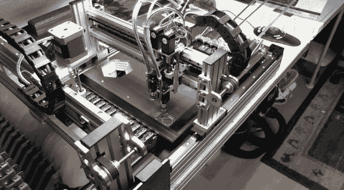

# 更新:半自动拾取和放置变成全自动

> 原文：<https://hackaday.com/2013/11/23/update-semi-automatic-pick-and-place-goes-fully-automatic/>

早在 4 月份，我们就关注了一个令人印象深刻的拾放机项目，它实际上还没有启动和运行。看起来[Brian Dorey]今年秋天真的加大了马力，[自 9 月以来发布了 9 个项目更新](http://briandorey.com/category/DIY-Pick-and-Place.aspx)。

以前的系统运行良好，但需要相当多的用户干预来完成实际的放置。因此，对新目标的第一次修改集中在机架的机动化上。有很多关于这方面的信息，以及为该系统设计的真空镊子头。但对我们来说，读到振动芯片进料器令人兴奋。这使用来自 Xbox 控制器的振动马达将 IC 从它们的管包装摇动到构建台旁边的分段夹具。休息过后，你可以看到一段视频，以及整个机器工作的演示。

[Brian]似乎喜欢 Xbox 部件，因为他还使用了 Xbox live 摄像头和 OpenCV 来检测部件，并确保它们排列正确。为了获得最佳效果，零件需要适当的照明，这就是为什么[他还用 144 个红色发光二极管制作了一个非常有趣的光环](http://briandorey.com/post/DIY-Pick-and-Place-V2-Base-Vision-LED-Array.aspx)。

振动零件进料器:

[https://www.youtube.com/embed/jd3zHoO6LUg?version=3&rel=1&showsearch=0&showinfo=1&iv_load_policy=1&fs=1&hl=en-US&autohide=2&wmode=transparent](https://www.youtube.com/embed/jd3zHoO6LUg?version=3&rel=1&showsearch=0&showinfo=1&iv_load_policy=1&fs=1&hl=en-US&autohide=2&wmode=transparent)

电路板填充:

[https://www.youtube.com/embed/3lkwWQpd66g?version=3&rel=1&showsearch=0&showinfo=1&iv_load_policy=1&fs=1&hl=en-US&autohide=2&wmode=transparent](https://www.youtube.com/embed/3lkwWQpd66g?version=3&rel=1&showsearch=0&showinfo=1&iv_load_policy=1&fs=1&hl=en-US&autohide=2&wmode=transparent)

[via [被黑的小工具](http://hackedgadgets.com/2013/11/22/diy-pick-and-place-machine-3/)