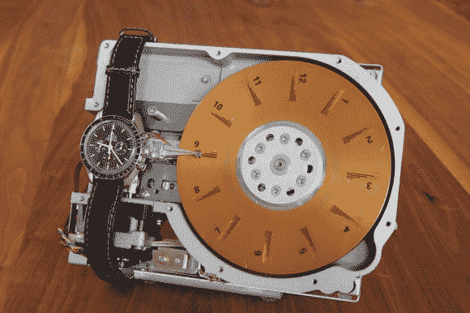

# ATMega16 硬盘时钟

> 原文：<https://hackaday.com/2013/11/23/atmega16-hard-disk-clock/>

[马丁·斯特罗姆]在大约 12 年前制作了这个看起来很棒的硬盘时钟，并最终决定与世界分享它。从此“嘀嗒”作响。

这是一座漂亮的钟，如果你觉得它看起来有点奇怪，那可能是因为它已经有 20 多年的历史了！我们不太确定容量，但不会超过几十兆字节。

为了读取时间，盘片每小时旋转 30 度。读写头在圆盘上缓慢移动以显示分钟。每条黑线代表一刻钟。整个事情由一个 ATMega16 控制，它维护几乎所有的原始硬件。这篇博客文章对这一切是如何运作的有很好的描述。

我们提到过设定时间也很容易吗？只需用手旋转光盘，将读写头滑动到位，然后按下复位按钮。休息后检查 c 锁的动作。

[https://www.youtube.com/embed/tSaW8k3-mBI?version=3&rel=1&showsearch=0&showinfo=1&iv_load_policy=1&fs=1&hl=en-US&autohide=2&wmode=transparent](https://www.youtube.com/embed/tSaW8k3-mBI?version=3&rel=1&showsearch=0&showinfo=1&iv_load_policy=1&fs=1&hl=en-US&autohide=2&wmode=transparent)

有多余的硬盘吗？这只是一个很好的例子，说明如何把它变成有用的东西！我们之前也见过[硬盘研磨机](http://hackaday.com/2012/11/22/hackaday-links-november-22nd-2012/)、[硬盘 DJ 便签本](http://hackaday.com/2012/07/29/two-hard-disks-and-one-dj-get-down-with-no-delay/)，甚至还有一个[棉花糖旋转器](http://hackaday.com/2013/03/30/used-hard-drive-repurposed-as-a-cotton-candy-machine/)。

[via [HackedGadgets](http://hackedgadgets.com/2013/11/17/hard-disk-clock-by-martin-stromer/)