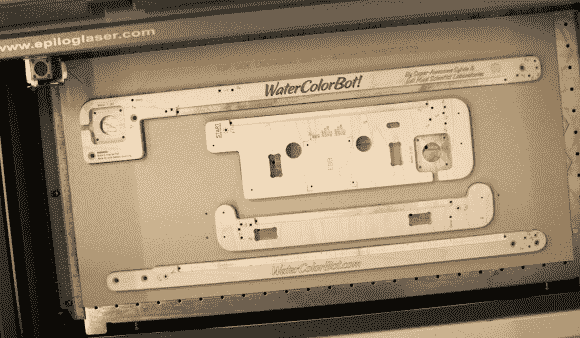

# 水彩机器人的制作

> 原文：<https://hackaday.com/2013/11/25/the-making-of-the-watercolorbot/>

记得水彩机器人吗？有没有想过制造这样的套件需要什么？邪恶疯狂科学家的人刚刚说漏了嘴。

这是一个很好的洞察，关于这些工具通常是如何在制造环境中制造的，特别是如果你碰巧是一个相当成功的 Kickstarter 项目的创始人，如[SuperAwesomeSylvia]的[水彩机器人](http://www.kickstarter.com/projects/1894919479/super-awesome-sylvias-watercolorbot-0)。这篇文章详细介绍了在 CNC 布线、使用夹具大规模生产激光雕刻、硬件装配和一些更复杂组件的挑剔装配过程中如何最大限度地减少材料浪费。更不用说装箱、储存和包装成品了！

我们很高兴听到水彩机器人现在正式发货，并可购买——看起来他们只差一个月左右就实现了 kickstarter 的交付目标。还记得我们最近发布的关于野外的水彩机器人的帖子吗？其中一个被用来通过驾驶一辆真正的汽车来创造艺术！