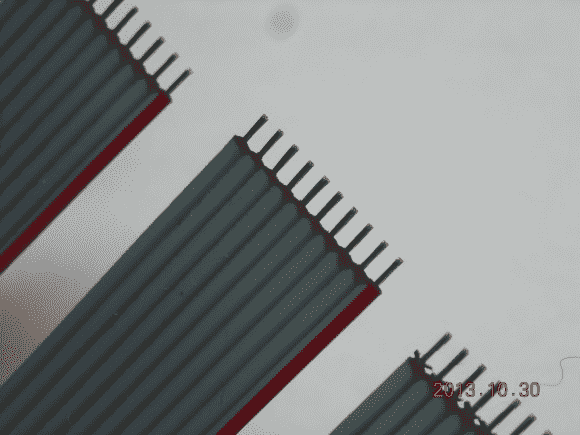

# 激光剥线

> 原文：<https://hackaday.com/2013/11/26/laser-wire-stripping/>

您是否发现自己需要剥去许多带状电缆？是不是很沮丧？好吧，如果你碰巧有一台激光雕刻机，我们的一个线人给我们的这个[酷指南](http://imajeenyus.com/electronics/20131024_laser_wire_stripping/index.shtml)可能正合你的胃口。

典型的剥离这些的方式是一条一条的，大量的脏话。或者，如果你经常这样做，你可能真的有合适的工具一次剥掉它们。实际上还有第三种解决方案，事实证明，这是实现准确性的商业方法之一，而且令人印象深刻。这里有一个[完整的 imgur gallery](http://imgur.com/gallery/assPb) 展示了一些花哨的剥离激光器的能力——我们尤其喜欢第三个。

无论如何，如果你碰巧有一个激光切割机，它就像雕刻几条线一样简单，并设置一个夹具来固定你的丝带。两边各传一次，然后完成！休息后有一个视频，但它是不言自明的。如果你碰巧批量生产任何需要带状电缆的东西，我们可以看到这非常方便！

[https://www.youtube.com/embed/TNVh-TvSz9k?version=3&rel=1&showsearch=0&showinfo=1&iv_load_policy=1&fs=1&hl=en-US&autohide=2&wmode=transparent](https://www.youtube.com/embed/TNVh-TvSz9k?version=3&rel=1&showsearch=0&showinfo=1&iv_load_policy=1&fs=1&hl=en-US&autohide=2&wmode=transparent)

【谢谢马特！]