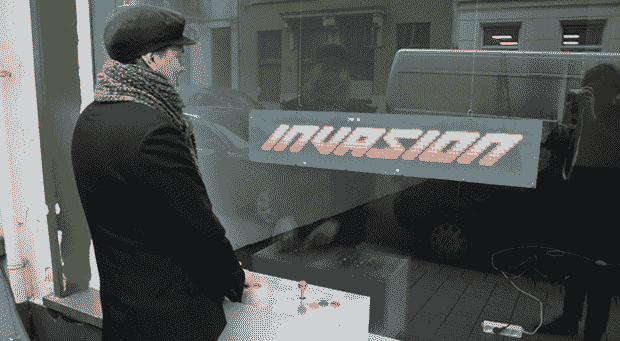

# 把店面变成电子游戏

> 原文：<https://hackaday.com/2013/11/27/turning-a-storefront-into-a-video-game/>

[Kris]“房子/办公室有一个巨大的商店橱窗，他没有用报纸盖住它，而是决定做一些很酷的事情。他为邻居展示了投影和其他艺术作品，但他的新店面街机游戏很可能胜过所有这些。

每个视频游戏都需要一个显示器，这个也不例外。显示器是一个 16*90 矩阵的 WS2812 发光二极管，嵌入激光切割网格，放在一层有机玻璃后面。有了这个网格，显示器就有了很好的光栅效果，非常符合克里斯追求的像素美学。窗户前面是一个由 Arduino Due 供电的 MDF 和钢制拱廊盒。

游戏由 Adafruit neopixel 库驱动，做了一些修改以支持 alpha 混合。这个游戏没有外部存储器——一切都在窗口内的第二个 Arduino 上运行。

这是一个看起来很棒的游戏，如果你曾经在安特卫普动物园后面的[克里斯]区，你可以自由地走上前去玩这个游戏。

下面是视频演示。

[https://player.vimeo.com/video/80190117](https://player.vimeo.com/video/80190117)