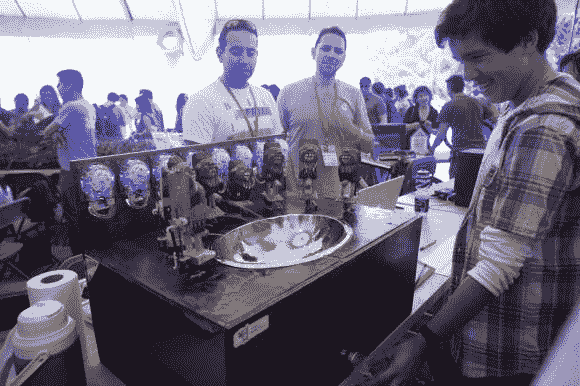

# 因迪奥皮卡罗娃娃混合饮料…

> 原文：<https://hackaday.com/2013/11/27/indio-picaro-doll-mixes-drinks/>

听说过因迪奥·皮卡罗娃娃吗？它们是那些有点奇怪的阴茎雕像，它们也是智利的一个全国性笑话。所以黑客们[内森]和[帕布罗]决定利用它的受欢迎程度，在刚刚过去的周末[圣地亚哥迷你创客节](http://makerfairesantiago.com/)推出一款搞笑的饮料服务机器人 ( [翻译](http://translate.google.com/translate?hl=en&sl=es&tl=en&u=http%3A%2F%2Findiopicaropissco.tumblr.com%2F))。

被称为 PissCO 的调酒师机器人(s？)利用八个[调酒师](http://partyrobotics.com/)饮料泵，这是一个今年年初在 Kickstarter 上成功[资助的系统。添加一些伺服系统，让小雕像](http://www.kickstarter.com/projects/partyrobotics/bartendro-a-cocktail-dispensing-robot?ref=live)[跳舞，绕着它们的……](http://vt.tumblr.com/tumblr_mubvajUgtR1skzdq9.mp4#_=_)摇摆。总之，整个系统可能是我们见过的最独特的鸡尾酒调制机器人之一。

毕竟，谁不想要一杯装在看起来有点像便池的不锈钢盆里的饮料呢？

休息后留下来，呃，看看它的运行。

 <http://vt.tumblr.com/tumblr_mv38fwRO511skzdq9.mp4?_=2>

[http://vt.tumblr.com/tumblr_mv38fwRO511skzdq9.mp4](http://vt.tumblr.com/tumblr_mv38fwRO511skzdq9.mp4)

尽管如此，我们认为我们最喜欢的 barbot 仍然是酒鬼

[via [Makezine](http://makezine.com/2013/11/24/a-chilean-drink-machine-with-a-sense-of-humor/)