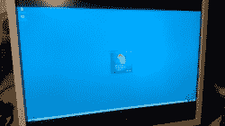
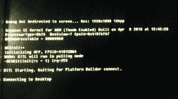
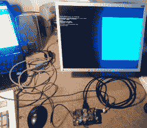
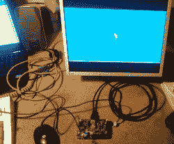

# 树莓派上的 Windows CE

> 原文：<https://hackaday.com/2013/11/27/windows-ce-on-a-raspberry-pi/>

从所有的 BSD 和 Linuxes 到非常奇怪的操作系统，似乎几乎每个操作系统都被移植到了 Raspberry Pi。除了 Windows 之外的所有东西，但是有几个人正在做这个。

这个构建来自于[ideeman]，他想要展示他运行 Windows Compact Embedded 的 Raspi。它在技术上是可行的，但是仍然有一些问题。用他自己的话说:

> 不幸的是，就像现在这样，除了通过内核传输层(通过串行，直接到 visual studio，我仍然会得到很多校验和错误，必须从我正在使用的 cheapo USB <==> TTL 3.3V 适配器)之外，我真的无法通过任何其他方式来控制它。最初的开发者(dboling)仍然在原生 USB 驱动中挣扎，但是正如你所看到的，他已经得到了一个(未加速的)运行显示驱动。
> 
> 如果你感兴趣，我可以给你发送编译后的内核映像，但我认为如果没有 Visual Studio 2008(+Platform builder 7.0)提供的串行调试，你不会做太多事情……不过我不确定它是否可以合法地发布给公众。

虽然运行 Windows Compact Embedded 不如在 Raspi 上运行 Windows RT 酷，但后者永远不会发生。Windows RT 需要 1 GB 的内存和 1 GHz 的 ARM v7 处理器，而 Pi 没有这两项。尽管如此，这仍然是一个非常令人印象深刻的技术，随着更多的开发人员加入，[dboling]和[ideeman]最终可能会有一个真正的功能系统。

下面是[ideeman]的 Raspi 运行 WinCE 的图片。对于[ideeman]，请在评论中随意链接到一个种子。

