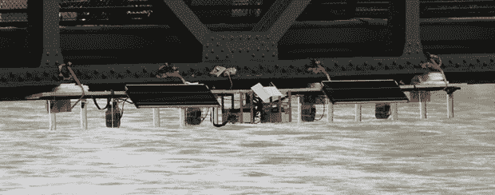

# 时间的流动牵引着一条河流

> 原文：<https://hackaday.com/2013/11/30/the-flow-of-time-draws-on-a-river/>

你可能会认为 Hackaday 会看到更多来自公共艺术展览的项目。他们真的什么都有——可以把电子设备安装到任何东西上，实现有趣但最终无用的功能。尽管如此，到目前为止，[理查德·施瓦茨的] [时间的流动](http://zeitfluss.islandrabe.com/doc/)是我们喜欢的公共艺术装置的一个非常短的列表的顶部。

建造背后的想法是一个德国短语，意思类似于“时间慢慢流逝”。[Richard]的项目通过将当前时间打印到[Richard]家乡因斯布鲁克的一条流动的河流表面来实现这一点。

该建筑使用五个微型压电泵从桥上分配食用色素。每一分钟，一个 Arduino 泵入这种 5×7 像素的食用色素，将时间“写”在河面上。

令人惊讶的是，[理查德]的安装不需要太多的维护。这些水泵每天只使用大约 70 毫升的食用色素，整个设备——包括 Raspi WiFi 网络摄像头——都是太阳能供电的，带有备用电池。

你可以在下面的一条河上看到当时印刷的视频。

[https://player.vimeo.com/video/79083339](https://player.vimeo.com/video/79083339)