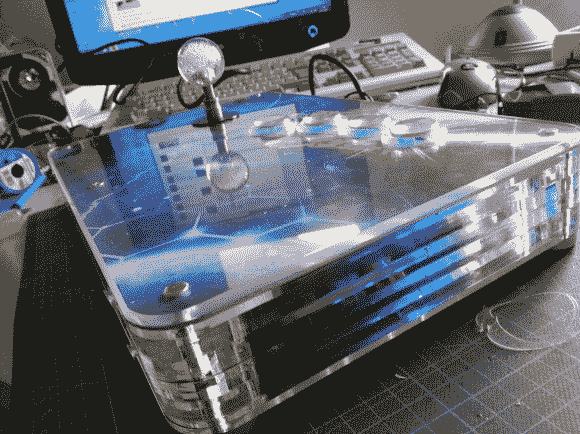

# 树莓派街机棒

> 原文：<https://hackaday.com/2013/11/30/a-raspberry-pi-arcade-stick/>

有很多 Raspberry Pi 街机版本，但我们很少遇到像[【Jochen zur Borg 的】RasPi 街机棒](http://bencao74.blogspot.de/2013/11/arcadeforgede-pijamma-project-building.html)这样光滑的东西。该版本结合了你从其他 RasPi arcade 项目中所期望的一切，但设法将一切都打包到以 Neo Geo 4 的按钮布局为模型的便携式棍子的形状因子中。它可能没有去年的[小 MAME 柜](http://hackaday.com/2012/11/26/tiny-mame-cabinet-built-from-raspberry-pi/)小，但它绝对提供了更真实的街机体验。

[Jochen]之前为 Pi 开发了一个名为[PiJamma](http://arcadeforge.net/PiJamma/PiJamma-Raspberry-Pi-Arcade-and-Retro-Gaming-Interface::106.html)的附加 PCB，通过为控制器提供 Jamma 接口，简化了与 RasPi gpio 的连接。Pi 和 PiJamma 位于定制的丙烯酸外壳内，并连接到上面的按钮和操纵杆。[Jochen]没有尝试将 Pi 直接安装在侧面板上以访问各种输出，而是重新布线了 USB、HDMI 和耳机插孔，并将它们整齐地排列在盒子的背面。外壳的顶部由一片包裹在定制艺术品中的铝板组成，顶部还有一片丙烯酸板用于保护。[Jochen]还修改了每个街机按钮，使其包括照亮按钮丙烯酸支架的 led，并且外壳本身似乎在每一侧都被切割成板条，以提供更好的通风。

查看他的项目博客以了解更多细节和大量进展照片，然后在休息后查看 RasPi Arcade Stick 的快速视频。

[https://www.youtube.com/embed/THXa2wELsas?version=3&rel=1&showsearch=0&showinfo=1&iv_load_policy=1&fs=1&hl=en-US&autohide=2&wmode=transparent](https://www.youtube.com/embed/THXa2wELsas?version=3&rel=1&showsearch=0&showinfo=1&iv_load_policy=1&fs=1&hl=en-US&autohide=2&wmode=transparent)