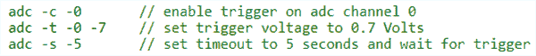

# Stellaris & Tiva 的外壳

> 原文：<https://hackaday.com/2013/12/01/a-shell-for-the-stellaris-tiva/>

当[antoker]在做一个微控制器项目时，他经常要写一些简短的测试代码，以确保电路中的一切都正常工作。这是一项耗时的任务，不久前他开始了一个小型的副业项目。它是微控制器的命令行接口，允许他通过串行连接向 uC 发送短命令，以处理 ADC、UART 和 GPIO 引脚。

[antoker]的微型 Unix 环境基于一些模块，这些模块可以跟踪时间，打印当前的命令并堆栈到终端，以及查询诸如 uC 的当前速度以及可用的闪存和 RAM 之类的事情。

这个微小的外壳还具有脚本功能和跳转功能，这使它成为一种真正的编程语言，尽管它很小。现在[antoker]的工作可用于 TI Stellaris 和 Tiva 系列微控制器，下面是一个脚本 Larson 扫描仪的视频。

[https://www.youtube.com/embed/sBu9Q8zHPFk?version=3&rel=1&showsearch=0&showinfo=1&iv_load_policy=1&fs=1&hl=en-US&autohide=2&wmode=transparent](https://www.youtube.com/embed/sBu9Q8zHPFk?version=3&rel=1&showsearch=0&showinfo=1&iv_load_policy=1&fs=1&hl=en-US&autohide=2&wmode=transparent)