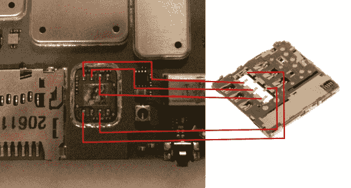

# 为 Photon Q 4G LTE 添加 SIM 卡

> 原文：<https://hackaday.com/2013/12/02/adding-a-sim-card-to-the-photon-q-4g-lte/>

[查尔斯]是一个有物理键盘的手机的大粉丝。他认为它们更适合写冗长的电子邮件，但不幸的是，他的 HTC Desire Z 越来越旧，所以他不得不更换它。因此决定从美国进口摩托罗拉光子 Q，这暴露了一个主要问题。威瑞森的电话使用 CDMA，所以没有地方放 GSM SIM 卡。但是一点黑客技术允许他在上面加了一个 SIM 卡槽。尽管他不是最初发现这种黑客行为的人(XDA 线程[在这里](http://forum.xda-developers.com/showthread.php?t=1929143)，他的文章绝对是一个有趣的读物。为了进行这一修改，他需要一个热空气回流站、一个烙铁、一个带有适当切割轮的 Dremel 和几个来自 Galaxy S3 的 SIM 卡插槽组件(因为第一批组件通常会在拆卸过程中烧毁)。

显然，第一步包括打开手机，这可能需要一段时间。使用热空气，[Charles]移除了覆盖 SIM 卡 IC 的 [EMI](http://en.wikipedia.org/wiki/Conducted_electromagnetic_interference) 屏蔽。然后他用同样的技术提取了后者。最后，他移除了另一个 EMI 屏蔽，它覆盖了 SIM 卡插槽应该连接的触点。几分钟/几小时的焊接和外壳改装之后，[Charles]可以在他全新的手机上使用他的 SIM 卡了。