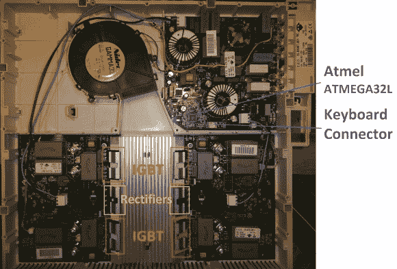

# 对电磁炉进行维修并添加蓝牙控制

> 原文：<https://hackaday.com/2013/12/02/repairing-and-adding-bluetooth-control-to-an-induction-cooker/>

当他用了 6 年的电磁炉最近坏掉时，[Johannes]决定打开它，试图给它另一种生活。他不仅成功了，而且他还为炊具添加了蓝牙连接功能。维修部分实际上非常简单，因为在大多数情况下，[IGBT](http://en.wikipedia.org/wiki/Insulated-gate_bipolar_transistor)和整流器是第一个因受到压力而损坏的部件。根据一个瑞典论坛的建议，[Johannes]只需测量这些元件的电阻，就能发现坏掉的元件就像开路一样。

然后，他开始对炊具中的电路板进行逆向工程，尤其是“键盘”和负责控制电源板的主微控制器(ATMEGA32L)之间的链接。通过一个总线盗版，[Johannes]看了一下使用的 UART 协议，但它似乎有点太复杂了。然后他选择了一个 IOIO 和几个晶体管来模拟按键，让他可以用手机控制炊具(通过 USB 或 BT)。当他在做的时候，他甚至加了一个温度传感器。