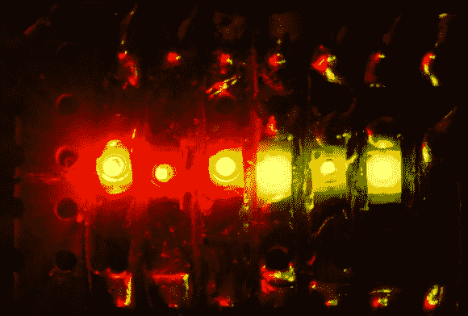

# 关于过度驱动 led 的建议

> 原文：<https://hackaday.com/2013/12/03/advice-about-over-driving-leds/>

我们通常保持在 led 的推荐安培数范围内，但多路复用显示器提供了一个有趣的机会，可以将它们推到这个范围之外。因为多路复用扫描一组 led，所以它们并不是一直都亮着。如果您的多路复用设置允许您保持在一定的时间范围和占空比内，则它们可以超过恒定电流规格。[Bryanduxbury]决定看看驱动 led 的最佳方式。

他给出的例子是，他的 30 mA 恒流额定器件可以接受高达 185 mA 的电流，但只有 0.1ms，占空比为 10%。如果你知道如何运用这些数字，你就能让它们变得更加明亮。当您的多路复用显示器已经在大部分时间关闭灯光时，这变得特别有用，因为最终的平均亮度会高得多。他的并排测试如上图所示。每个颜色组的左边是限流 LED，中间是正常电压驱动的多路复用 LED，右边是过驱动的多路复用 LED。

[Bryan]提到的最大缺点是，如果你的固件挂起时间超过规定时间，你肯定会烧坏这些二极管。