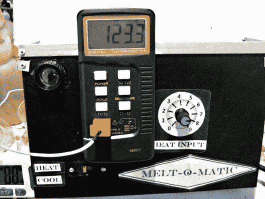

# “Melt-O-Matic”——一种数字熔点仪器

> 原文：<https://hackaday.com/2013/12/05/the-melt-o-matic-a-digital-melting-point-apparatus/>

有机化学中的一种常用技术是测定样品的熔点。虽然存在商业选择，但[kymyst]决定[建造一个具有类似(或更好)功能的](http://www.instructables.com/id/MELT-O-MATIC-DIGITAL-MELTING-POINT-APPARATUS/)，并设法将其保持在 100 美元以下。他装备的基础是一个 60W 的烙铁。他只是用一个铝制加热块代替了普通的焊接头，加热块上有毛细管和温度探头。两个小风扇用于快速冷却加热块，允许相当快的测量时间。应该注意的是，建设这样一个项目将意味着使用 220V(或 115V，取决于您的国家)的电线。请采取适当的预防措施。

如果有机化学在你的“要学的”清单上，[kymyst]包括了一篇很好的熔点测定的文章。对于那些有兴趣了解更多的人来说，这是一本很好的入门书。

使用这种设置，[kymyst]可以获得 0.1°c 的读数。他提到了添加网络摄像头以自动确定熔点的可能性，这将使该系统与昂贵得多的硬件相比具有竞争力。

上一次我们看到这些[中的一个，它使用热胶枪作为加热元件](http://hackaday.com/2013/02/08/building-a-tool-to-measure-melting-point/)。