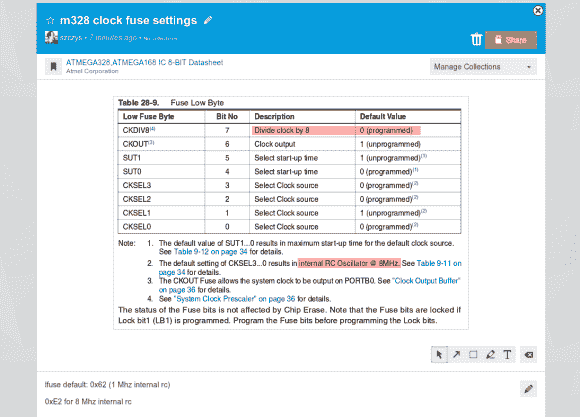

# 使用 Datasheets 破解您的数据表

> 原文：<https://hackaday.com/2013/12/04/hack-your-datasheets-using-datasheet-net/>

如果您使用数据表(这可能是 Hackaday 的每个读者)，您需要检查一下这个工具，它试图[向几十年前的组件规范交付系统](http://blog.datasheet.net/2013/12/03/datasheet-net-is-live/)添加现代功能。该链接将带您进入 Datasheet.net 的[发布公告。](http://www.datasheet.net/)

你在上面看到的是该服务带来的最大功能，即通过单击并拖动你想要保存的区域来从数据表创建“片段”的能力(你甚至可以获得[到片段](http://www.datasheet.net/snippet/529f51ac66209b1b0500001e/f17e61c0c1028064494557166076f09d)的公共链接)。一旦你选择了一个代码片段，有一些工具可以让你在上面做注解。我们使用矩形工具突出显示了 ATmega328 uC 的时钟速度和分频器设置。该界面还提供徒手绘制箭头或向代码片段添加文本的能力。在这个例子的底部，我们使用描述区域来表示我们在这个芯片上最常使用的保险丝设置(十六进制)。这些片段和注释可以与服务的其他用户共享，片段下面还有一个评论部分供您的团队使用。请看下面视频中的例子。

这解决了我们对 PDF 数据表最大的不满之一——来回跳转和轻松找到常用部分的能力。该数据表长达 567 页，重复查找相同的信息并不好玩。它还提供了基本的“收藏”标记，以保存您经常使用的纸张列表——但我们希望看到更多对我们的收藏进行分类的选项。我们还发现，如果没有我们在普通文档视图中习惯的目录功能，就很难生存。我们已经要求首席开发人员[Ben Delarre]添加这个功能。他就是那个创建原理图共享网站 [CircuitBee](http://hackaday.com/2011/07/27/circuitbee-makes-sharing-schematics-and-circuit-diagrams-easy/) 的人。现在是时候提一下这项服务是由 Hackaday 的母公司 SupplyFrame 拥有的。

Datasheet.net 有大量的数据手册可供搜索，但计划增加的功能包括数据手册上传。列表中还有一个“讨论”功能，听起来很有趣。如果通过讨论引擎搜索数据手册，也能找到使用该器件的开放硬件项目列表，会怎么样？我们也对将这些片段直接嵌入网页的能力垂涎三尺。[Ben]告诉我们已经构建好了，但是他们没有时间在发布前将其添加到 UI 中。为你的博客文章截图的日子将一去不复返了！

PDF 格式的数据手册彻底改变了电子元件信息的获取方式。我们希望这标志着下一次进化。除了更好的工作特性之外，如果您能够在发布新的数据表修订版或勘误表时收到通知，那不是很好吗？

[https://www.youtube.com/embed/A6Ym65smCLs?version=3&rel=1&showsearch=0&showinfo=1&iv_load_policy=1&fs=1&hl=en-US&autohide=2&wmode=transparent](https://www.youtube.com/embed/A6Ym65smCLs?version=3&rel=1&showsearch=0&showinfo=1&iv_load_policy=1&fs=1&hl=en-US&autohide=2&wmode=transparent)