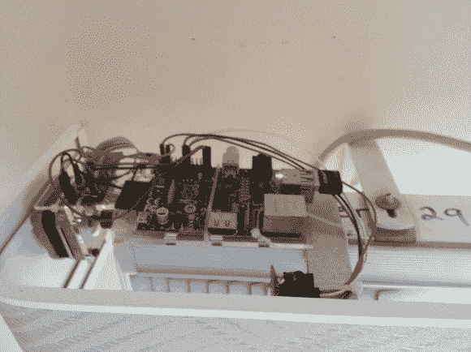

# Raspi AC 和百叶窗控制器

> 原文：<https://hackaday.com/2013/12/07/raspi-ac-and-blinds-controller/>

[克里斯的]卧室有一个独特的设置，一个空调装置放在墙上，紧挨着遮住他窗户的百叶窗顶部。通常，要打开百叶窗，他必须拉一根绳子，而操作空调意味着摆弄一个遥控器。不再是了。现在[Chris]有了一个基于 Raspberry Pi 的一体化解决方案来驱动这两个。

该建筑使用从打印机中回收的步进电机直接驱动百叶窗，一个熟悉的简单驱动器将其连接到 Pi。电机旋转百叶窗的机械装置，使其打开或关闭，尽管速度适中，足以提供所需的扭矩。[Chris]添加了一个插入 Pi 的红外二极管，模仿空调设备的远程控制，并简单地将它直接指向设备的接收器。一个廉价的 WiFi 加密狗将 Pi 接入网络，允许[Chris]通过定制的网络界面进行交互。界面本身不仅提供了几个可点击的按钮，还提供了一个设计巧妙的状态图像，指示百叶窗的位置。

请务必观看下面的视频进行演示，并了解更多关于构建的详细信息。这是我们最近看到的家庭自动化设备的一个更好的例子，特别是考虑到它实际上符合几个月前我们在 [Ask Hackaday 帖子](http://hackaday.com/2013/10/09/ask-hackaday-what-is-home-automation/)中讨论的“自主”含义——尽管相对简单的自动化，[Chris]界面确实允许按照预选的时间表操作百叶窗和空调。

[https://www.youtube.com/embed/BUByva96yDY?version=3&rel=1&showsearch=0&showinfo=1&iv_load_policy=1&fs=1&hl=en-US&autohide=2&wmode=transparent](https://www.youtube.com/embed/BUByva96yDY?version=3&rel=1&showsearch=0&showinfo=1&iv_load_policy=1&fs=1&hl=en-US&autohide=2&wmode=transparent)