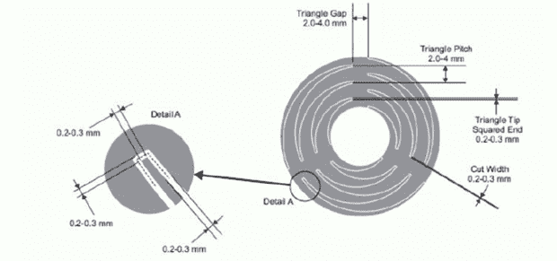

# 通过 OpenSCAD 的触摸滚轮

> 原文：<https://hackaday.com/2013/12/08/a-touch-scroll-wheel-via-openscad/>

最近对 Arduino CapSense 库的实验让[Bryan]在互联网上寻找有趣的应用。他偶然发现了一个非常酷的触摸滚轮，完全由 PCB 走线制成，但几何形状——三个交错的之字形不可能在明显不几何的 Eagle PCB 封装中构建。事情一件接一件，现在[Bryan]有了一个完全在 OpenSCAD 中设计的 cap touch wheel Eagle 部件[。](http://bryanduxbury.com/2013/12/05/designing-a-capacitive-touch-wheel-in-openscad-and-eagle/)

[Bryan]发现的触摸滚轮实现来自第一张[触摸控制器数据表](http://www.datasheetlib.com/datasheet/705489/qst608_stmicroelectronics/download.html)，并使用奇怪形状的图案来创建一个电容传感器。Eagle 不擅长设计任何不以 45 度角布局的东西，所以他启动了 OpenSCAD 来绘制这些三角形。导入 Eagle 是另一个挑战，但是一个快速的 Ruby 脚本将一个 DXF 文件转换成 Eagle 的多边形命令的一组坐标使得一切变得非常容易。

如果你不喜欢打开触摸传感器，[还有一个装满它们的老鹰图书馆](http://hackaday.com/2013/12/04/easy-capacitive-touch-sensors-in-eagle/)——这是我们上周发现的。