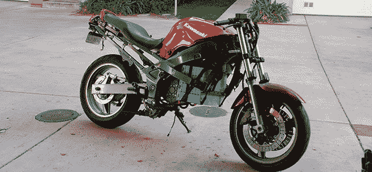

# 一辆很棒的电动自行车

> 原文：<https://hackaday.com/2013/12/08/an-awesome-electric-bike/>

将摩托车改装成电动的一直是我们最喜欢的项目，而[【彼得】的身材和他们其他人一样好](http://turnerpeterk.blogspot.com/2013/10/electric-motorcycle.html)。

这辆自行车是他从废品收购站买的 2002 款 ZX6E。多年来，这种非常轻的铝框架已经被分离出来，售价 250 美元，是完美的电动转换框架。在从他哥哥那里学会了 MIG 焊接之后，[Peter]切下了几块金属板，为他的新 4.2 kW 发电厂建造了一个马达架。

控制器是他在易贝找到的一个 300 安培的 IGBT，一个看起来非常坚固的电路[内置在一个弹药箱](http://turnerpeterk.blogspot.com/2013/10/update-i-built-gate-driver-adding-18v.html)中。自行车的马达换成了提供 52 伏电压的 [16 节 60Ah 生命电池](http://turnerpeterk.blogspot.com/2013_12_01_archive.html)。[Peter]还使用 Cypress PSoC 3 微控制器和漂亮的定制 PCB 构建了自己的电池管理系统。

离完工还有很长的路要走，但是彼得已经有了一辆很棒的自行车和一个很棒的周末项目。