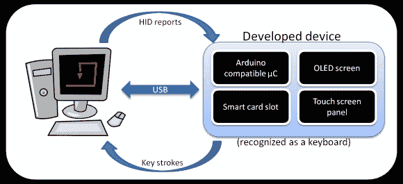
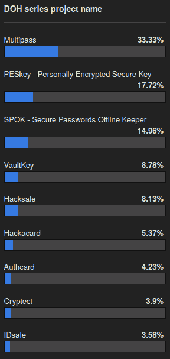

# 在 Hackaday 上开发:来自用户的第一次反馈

> 原文：<https://hackaday.com/2013/12/09/developed-on-hackaday-first-feedback-from-users/>

神圣的 cr*p 伙计们…我们对我们上一篇文章的评论区留下的正面反馈数量感到惊讶。我们被 [Slashdot](http://it.slashdot.org/story/13/12/08/1447232/storing-your-encrypted-passwords-offline-on-a-dedicated-device) 特写了！我们收到了大量的项目名称建议，因此我们在本文末尾组织了一次投票，让你决定哪一个是最好的。我也收到了许多人的电子邮件，他们渴望开始为这个离线密码管理员项目做贡献。如果你错过了电话，想参与进来，现在还不算太晚。你可以联系我@ mathieu[at]hackaday[dot]com。到目前为止，我们有许多 beta 测试人员、几名软件开发人员、一名安全评估人员和几名固件开发人员。一旦选定了项目名称，下一步就是创建邮件列表和黑客论坛类别。

显然，我们“在 Hackaday 上开发”系列的第一篇文章是为了评估你对这个“新”项目的最初反应。请注意这里的双引号，因为当有人有了一个新想法时，通常只有两种可能可以解释为什么它还不存在于市场中:要么是[完全愚蠢](http://hackaday.com/2013/04/01/hackadays-very-first-kickstarter-campaign/)要么是[人们已经在研究它了](http://www.seeedstudio.com/depot/nose-led-kit-p-1274.html)。在我们的例子中，我们似乎属于第二类，因为许多读者提到他们想工作/正在工作/已经工作在一个类似的产品上。因为我们很自私，我们让他们为这个新设备做贡献。

为了确保我们所有的读者都了解该设备将如何工作，我们在休息后嵌入了一个简单的框图，以及根据我们收到的反馈，我们希望实现的所有新功能的列表。所以请继续阅读，看看未来会怎样，并为这个新项目的名字投票…

由于我们在这个项目中并不真正需要 ARM 处理器，我们唯一可以使用的同时保持直接 Arduino 兼容性的微控制器是来自 Atmel 的 [ATmega32U4](http://www.atmel.ch/devices/ATMEGA32U4.aspx) 。我们还没有选择在哪个 IDE 上开发(如果我们真的使用一个的话)。该设备将被识别为 USB 键盘(USB HID 类)，因此在 Windows/Linux/Mac/Android/你拥有的任何系统上都不需要驱动。我们的一些朋友实际上告诉我们，平板电脑和最近的手机可以通过 USB OTG 端口枚举 HID 设备。我们可以使用来自[迪安相机]的伟大的[LUFA 库](http://www.fourwalledcubicle.com/LUFA.php)或来自[保罗·斯托佛雷根]的[Teensy 代码](http://www.pjrc.com/teensy/usb_keyboard.html)进行 USB 通信。我们“在 Hackaday 上开发”系列的下一个帖子将是关于所选硬件的，因此我们欢迎亲爱的读者在下面的评论部分提出任何建议。

由于一些读者担心使用建议的设置仍有可能丢失存储的密码，我们想强调一个事实，即该设备将能够克隆您的智能卡(例如包含您的 AES 密钥和主电子邮件密码)。显然，只有在初始智能卡解锁后，它才会这样做，并将相同的 PIN 码复制到新卡中。请注意，克隆卡应该保存在一个安全的地方。我们还将提供导出存储在设备内部存储器中的加密密码的可能性(图中未显示)。

我们之前提到过，浏览器扩展会将当前访问的网站发送到设备，因此用户可以通过点击触摸屏来批准发送其凭据。[tekkieneet]提出了一个非常重要的观点:一个用户可能总是点击“是”，而没有检查所访问的网站是否与有机发光二极管屏幕上显示的相同。[Tekkieneet]更喜欢让用户浏览所有保存的网站凭证，而不使用操作系统端的任何插件。在我们看来，这降低了用户友好度…你怎么看？我们能不能想出一种方法来强迫用户检查显示的 URL？

【happy jam 64】还建议我们应该强制用户每隔几个月更换一次密码。这对新手用户来说会不会很麻烦？我们应该允许用户选择他们想要的安全类型吗？很明显，我们在这里讨论的是权衡。

这里还有一个问题要问我们的读者:一旦用户输入了 pin 码，我们应该在多长时间内解锁智能卡？短时间的使用可能会使设备在日常使用中变得令人讨厌，而长时间的使用则会危及系统的安全性。黑客作家有根据的猜测是通过移除智能卡来迫使用户在外出时锁定他们的电脑。该设备将检测到卡已经不在这里，因此执行一个按键来锁定计算机(linux 和 mac 的 windows + L 是什么？).当我们的熟人不在电脑前时，我们必须教他们锁上电脑(这似乎很合理，对吗？).

我们期待着阅读您对这些关键点的意见，我们将很快在我们的黑客日系列开发的下一集与您见面(感谢[Ren])。同时，别忘了为你最喜欢的项目名称投票！