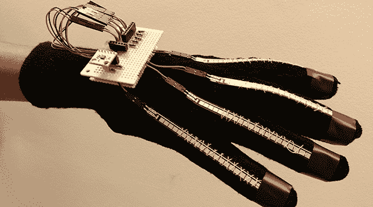

# Kinect 控制的机械手

> 原文：<https://hackaday.com/2013/12/10/a-kinect-controlled-robotic-hand/>

又到了一年中高级设计项目蜂拥而至的时候了。[Ben]和他的合作伙伴[Cameron]、[Carlton]和[Chris]自 9 月以来一直在致力于一个非常雄心勃勃的项目:[一个由 Kinect 控制的机械臂和手](http://benpyeh.wordpress.com/2013/12/07/senior-design-robotic-arm-with-kinect-interface-detailed-report-long-post/)，它可以复制用户的动作。

这个手臂是一个 lynx motion AL5D，但不是包含的软件套件，而是这些人在 Arduino 的帮助下推出了他们自己的控制这个手臂的方法。Kinect 捕捉用户的手臂位置，并将其转化为手臂伺服系统的数据。

当然，Kinect 的分辨率是有限的，所以对于手腕以外的一切，该团队转向了另一项技术——弯曲电阻器。一只手套结合了这些柔性电阻和一个加速度计，提供了手和手指在空间中的所有位置数据。

这些数据被发送到建筑上的另一个 Arduino，用于定位机械臂的手腕和手指。正如下面的视频所示，arm 表现得非常好，就像你见过的最好的 Waldos 一样。

[https://www.youtube.com/embed/9_fKk7HIUMM?version=3&rel=1&showsearch=0&showinfo=1&iv_load_policy=1&fs=1&hl=en-US&autohide=2&wmode=transparent](https://www.youtube.com/embed/9_fKk7HIUMM?version=3&rel=1&showsearch=0&showinfo=1&iv_load_policy=1&fs=1&hl=en-US&autohide=2&wmode=transparent)

[https://www.youtube.com/embed/PMoiRCuZtvs?version=3&rel=1&showsearch=0&showinfo=1&iv_load_policy=1&fs=1&hl=en-US&autohide=2&wmode=transparent](https://www.youtube.com/embed/PMoiRCuZtvs?version=3&rel=1&showsearch=0&showinfo=1&iv_load_policy=1&fs=1&hl=en-US&autohide=2&wmode=transparent)