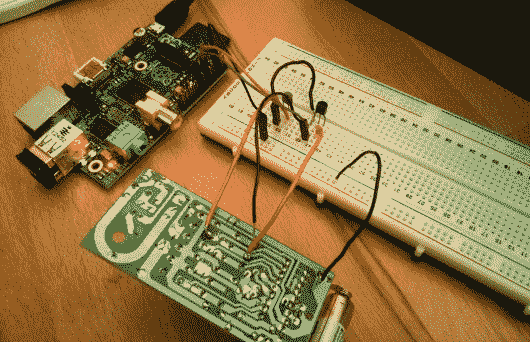

# 通过树莓派实现灯的互联网功能

> 原文：<https://hackaday.com/2013/12/11/internet-enabling-a-lamp-with-the-raspberry-pi/>

[杰克]提交了他为[互联网启用家庭灯](http://jack.minardi.org/raspberry_pi/make-an-internet-controlled-lamp-with-a-raspberry-pi-and-flask/)撰写的文章。虽然我们肯定会有一些评论说这太简单了，但它在将事情分解到基础方面做得很好。对于那些对自己的电子技能不自信的人来说，这是一个简单的侵入商业设备的方法，可以极大地扩展它的功能。【杰克】从[一个便宜的无线插座控制器](http://www.amazon.com/gp/product/B003ZTWYXY/ref=as_li_qf_sp_asin_tl?ie=UTF8&camp=1789&creative=9325&creativeASIN=B003ZTWYXY&linkCode=as2&tag=jackminardior-20)开始。通过打开遥控器并将每个开关连接到 2N222A 晶体管，您可以非常容易地从 Raspberry Pi 上的 GPIO 引脚控制遥控器。在[杰克]的例子中，他用[烧瓶](http://flask.pocoo.org/)建立了一个网页，允许快速开/关控制。

当然，这种方法可以用在任何有无线控制器的场合，从小台灯到车库门。鉴于它的简单性，任何人都可以用最基本的技能来做。如果你是一个渴望做一些家庭自动化的初学者，跟随[杰克]的文章，从你的待办事项列表中检查一项！