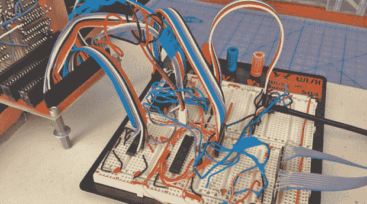

# 维罗妮卡得到一对游戏手柄和一个被窃听的芯片

> 原文：<https://hackaday.com/2013/12/11/veronica-gets-a-pair-of-gamepads-and-a-bugged-chip/>

[Quinn Dunki]令人敬畏的基于 6502 的计算机即将问世，她决定[是时候添加她受到启发的 80 年代微型计算机中最重要的功能之一](http://quinndunki.com/blondihacks/?p=1461)——游戏手柄。

在 80 年代，有两种实现游戏手柄的方法。Apple II 模拟操纵杆为每个操纵杆轴使用了一个电位计，以及一个 556 定时器芯片，以将电位计的电阻转换为数字值。模拟控制很棒，但是需要很多硬件。另一个选项是 Atari/Commodore 操纵杆，它使用每个方向的按钮。令人惊讶的是，这些操纵杆在古董市场上异常昂贵，但类似的硬件设置——NES 游戏手柄——却很常见，非常便宜，并且有非常好的记录。

[Quinn]写了一些 6502 汇编，在 ATMega168 的帮助下，用 Veronica 的 6522 VIA 读取这些任天堂控制器，然后一切都变得一团糟。

在测试她的设置时，她发现有时控制器的数据线会与时钟线不同步。四个月来，[Quinn]一直在这个问题上挣扎，想出了两个可能的问题之一:要么是她的电路坏了，要么是 Veronica 中的 6522 芯片坏了。你可以猜测哪个选项是正确的，但你很可能是错的。

问题原来是 6522。原来这个芯片和外部时钟一起使用的时候有一个 bug。在 40 年的生产中，这个问题一直没有得到解决，但幸运的是，6502 向导[Garth Wilson] [有一个解决这个问题的方法](http://forum.6502.org/viewtopic.php?t=342#p2310):只需添加一个触发器，一切都是合法的。如果在当前的数据表中提到这个错误就好了…

现在，Veronica 有了两个 NES 控制器输入和必要的电路来使一切工作。下面视频证据。

 [https://www.youtube.com/embed/cVIbIBLpCQA?version=3&rel=1&showsearch=0&showinfo=1&iv_load_policy=1&fs=1&hl=en-US&autohide=2&wmode=transparent](https://www.youtube.com/embed/cVIbIBLpCQA?version=3&rel=1&showsearch=0&showinfo=1&iv_load_policy=1&fs=1&hl=en-US&autohide=2&wmode=transparent)