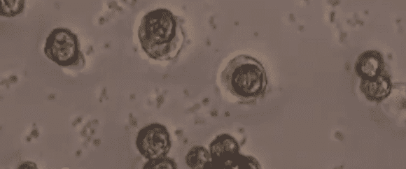

# 机器学习被用来制造艾滋病毒疫苗

> 原文：<https://hackaday.com/2013/12/16/machine-learning-used-to-create-an-hiv-vaccine/>

当我们想到机器学习时，它通常是在机器人的背景下——给一个算法一个大的输入数据集，以便训练它完成某项任务[，如导航](http://hackaday.com/2012/01/03/nerual-networks-control-a-toy-car/)或[理解你的笔迹](http://hackaday.com/2012/05/03/machine-learning-lets-micro-decode-your-handwriting/)。但事实证明，你也可以训练一种讨厌的病毒，让它沉睡，永远不再醒来。这正是[免疫项目](http://www.immunityproject.org/)一直在做的事情。他们相信他们有一种可行的艾滋病毒疫苗，并试图筹集大约 2500 万美元开始人体试验。

这种疫苗攻击人类免疫缺陷病毒本身，迫使它变异成一种休眠形式，不会攻击其人类携带者。这听起来很简单，但很多现有的知识和程序，以及新技术，都有助于实现这一目标。上周，我们采访了[[Reid rub samen，医学博士](http://rubsamen.com/)]来了解这一过程，这一过程是从广泛的“[控制者](http://en.wikipedia.org/wiki/Long-term_nonprogressor)”身上收集血液样本开始的。控制者是携带艾滋病病毒但设法抑制病毒发展成艾滋病的人。你是怎么找到这些人的？那是 [*科学美国人报道的另一个故事*](http://rubsamen.cimg/Walker_2012-Scientific_American.pdf)(PDF)；简短的回答是，由于[布鲁斯·d·沃克，医学博士](http://ragoninstitute.org/portfolio-item/walker-lab/)的工作，已经有了一个可用的控制器数据库。

[沃克]收集的信息随后经过了数据处理。数据集如此庞大，以至于采用了一种新颖的方法。对于外行人来说，这被描述为一个垃圾邮件过滤器:使用计算机来查看大量的电子邮件，以开发一个复杂的过程来从噪音中筛选出真正的信息。手头的任务是观察控制者的基因型，并将其与他们携带的病毒中的[表位](http://en.wikipedia.org/wiki/Epitope)——一种短链蛋白质——进行比较。机器学习的力量设法将所有数据缩减为具有所需休眠突变特性的前六个表位的列表。疫苗由这些表位的混合物组成。然而，它确实需要一些聪明的运送策略来到达世界上最需要它的地方。这种疫苗不需要冷藏，也不需要任何特殊的操作技巧。

疫苗的生产使用现有的方法来合成氨基酸肽，这些肽本身就是表位。然而，包装是一个新概念。Rubsamen 博士]的公司[Flow Parma，Inc .](http://www.flowpharma.com)正在使用微球来封装疫苗，这使其能够稳定储存，并允许通过鼻腔喷雾给药。从[这份白皮书](http://hackaday.com/wp-content/uploads/2013/12/flow-focusing-sphere-manufacturing.pdf) (PDF)中了解更多关于微球生产背后的技术。

如果这种疫苗(将在无利润的情况下生产)通过临床试验，它最早可能在 2017 年大规模上市。

我们之前提到的 2500 万美元是一座难以攀登的高山，但是想想如果疫苗成功的奖励。你可以[直接捐赠](https://rally.org/immunityproject)来帮助达成这个目标。如果你今年打算赠送礼品卡，你可以通过 [Gyft 为许多不同的零售商购买，Gyft 将 12 月的收入 100%捐赠给项目](http://www.gyft.com/immunity-project/)。